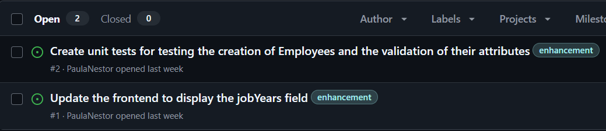
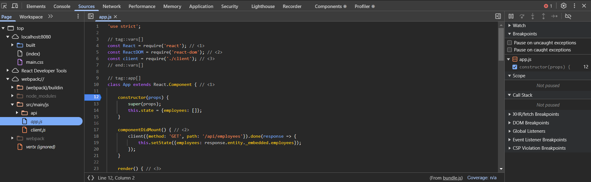

# CA1 - Part1: Version control with Git - Technical Report

Author: Ana Paula Lopes Nestor

Programme: SWitCH DEV

Course: DevOps

## Introduction

This section of the report details the two parts of Part 1 of CA1. In **Part 1.1**, version control without branches was used to implement a new feature (job years), adding a new field to the application.

## Setup and configuration

To begin the assignment, a repository containing the **Tutorial React.js and Spring Data REST** application was cloned into a local folder on my computer (devops). The next step was to set up my own repository, which would host the class assignments and allow me to keep track of all modifications and improvements made.

**Setting up my repository:**  

To start, I created a repository on GitHub. Then, using Git Bash, I cloned this repository into a folder that I had previously created to store my DevOps project (ProjetoDevOps). The command used to clone the repository was as follows:  

```
git clone <repository-URL> "C:\Users\paula\ProjetoDevOps"
```
  
This step allowed me to have a local copy of the repository on my machine.  
Alternatively, instead of cloning the repository, I could have created a new local repository using the **git init** command and then linked it to the remote repository.  

**Copying the basic folder of the Tutorial application:**  
  
After cloning the repository, I created the **CA1/part1** folders and I copied the basic folder from the Tutorial React.js and Spring Data REST application (which I had initially cloned into my devops folder) into my newly created folder.
I used the following command to perform this action:

```
cp -r "C:\Users\paula\devops\devops-spring-react\basic" "C:\Users\paula\ProjetoDevOps\devops-24-25-1241898\CA1\part1"
```  
**Creating .gitignore file and commiting changes:**  

Next, I created a .gitignore file using [this generator](https://www.toptal.com/developers/gitignore), which originates a list of files and directories that should be ignored by Git (e.g., system files, IDE settings). After adding this file to my project, I staged, committed, and pushed my changes to the remote repository with the following commands:  

```
git add .  
git commit -m "Created .gitignore and README.md"  
git push origin main  
```  

This process ensured that my repository was correctly initialized with the project files, including the .gitignore.  

**Issue tracking:**  

In order to structure the development process and keep track of tasks efficiently, I used GitHub Issues. Issues help document specific tasks, feature enhancements, bug fixes, making it easier to manage progress. They can be categorized using labels and can have assignees.  

To create an issue, I followed these steps:

* Navigated to the Issues tab in the GitHub repository.
* Clicked on New Issue.
* Provided a title, description and assignee to define the task.
* Added a label to categorize the issue.

For the **part 1.1** of this assignment, I created two issues:

  

By using issues, I maintained an organized workflow and ensured that key tasks were well-documented.  

## Part 1.1 : Version control without branches  

**Main goals:**  

The first part of the assignment focused on basic version control operations without branching. After setting up the project, I was able to make changes directly in the main branch and track the development process via commits and version tags. The learning process involved adding a new field (jobYears) to the Employee class and developing unit tests in order to test the creation of Employees and the validation of their attributes whilst tracking the development of the project by tagging different versions. In version control, **tags** are used to mark specific points in the repository’s history, such as releases or feature completions.
In this assignment, tags were used to mark important stages in the development process, such as the **initial version** and the **version after adding the new feature and tests**, allowing for easy reference to the initial setup and later updates.  

**Implementation Details:**  

After creating the CA1/part1 folders, copying the basic folder from the Tutorial React.js and Spring Data REST application, I commited and pushed the changes to the main branch. At this point I **tagged the initial version as v1.1.0**, following the major.minor.revision pattern. This tag marks the starting point for the project.
To creat and push the version tag to the remote repository the following commands were used:  

```
git tag v1.1.0
git push origin v1.1.0
```  

The following step was the implementation of the new field, **jobYears**, that keeps track of the number of years the employee has worked in the company. Unit tests were also developed in order to test the correct creation of Employee objects and the validation of their attributes, guaranteeing they were valid (the jobYears field could only accept non-negative integers and the String fields could not be null or empty).
To incorporate the new feature the following files were changed:  

* **Employee.java**: The jobYears field was added, along with its getter and setter methods and methods to validate the Employee objects attributes. Below are the major changes made to incorporate the new functionality in the code:  

```
    public Employee(String firstName, String lastName, String description, Integer jobYears) {

		if(areParametersValid(firstName, "First name"))
			this.firstName = firstName;

		if(areParametersValid(lastName, "Last name"))
			this.lastName = lastName;

		if(areParametersValid(description, "Description"))
			this.description = description;

		if(isJobYearsValid(jobYears))
			this.jobYears = jobYears;
	}

	private boolean areParametersValid(String parameter, String fieldName) {

		if(parameter == null || parameter.isBlank())
			throw new IllegalArgumentException(fieldName + " cannot be null or empty!");

		return true;
	}

	private boolean isJobYearsValid(Integer jobYears) {

		if(jobYears == null || jobYears < 0)
			throw new IllegalArgumentException("Job Years must be a positive number!");

		return true;
	}
	
	public int getJobYears() { return jobYears; }

	public void setJobYears(int jobYears) { this.jobYears = jobYears; }
	
```  

* **EmployeeTest.java**: This class was created as part of the newly established **test** directory, since prior to this, no tests existed for the class. The tests developed validate the functionality of the Employee constructor and ensure the correct validation of the Employee objects attributes. By validating each version, tests help to ensure that each update maintains system integrity.
 Two tests were developed in order to check that the Employee constructor correctly creates Employee objects when valid parameters are provided, including an edge case with 0 years.  

```
@Test
    void shouldCreateEmployee() {

        //act
        Employee employee1 = new Employee("John", "Doe", "Developer", 5);
        Employee employee2 = new Employee("John", "Doe", "Developer", 0);

        //assert
        assertNotNull(employee1);
        assertNotNull(employee2);

    }
```  

 To test invalid parameters, parameterized tests were used in order to validate that the Employee constructor would correctly throw an IllegalArgumentException when invalid inputs were provided. This test checks multiple invalid scenarios such as null, empty, or blank values for firstName, lastName, or description and invalid values for jobYears, including null and negative numbers. Each invalid combination is expected to throw an exception with a specific message as seen below:  

```
    public static Stream<Arguments> provideInvalidParameters() {
        return Stream.of(
                arguments(null, "Doe", "Developer", 5, "First name cannot be null or empty!"),
                arguments("", "Doe", "Developer", 5, "First name cannot be null or empty!"),
                arguments(" ", "Doe", "Developer", 5, "First name cannot be null or empty!"),
                arguments("John", null, "Developer", 5, "Last name cannot be null or empty!"),
                arguments("John", "", "Developer", 5, "Last name cannot be null or empty!"),
                arguments("John", " ", "Developer", 5, "Last name cannot be null or empty!"),
                arguments("John", "Doe", null, 5, "Description cannot be null or empty!"),
                arguments("John", "Doe", "", 5, "Description cannot be null or empty!"),
                arguments("John", "Doe", " ", 5, "Description cannot be null or empty!"),
                arguments("John", "Doe", "Developer", null, "Job Years must be a positive number!"),
                arguments("John", "Doe", "Developer", -1, "Job Years must be a positive number!")
        );
    }
    @ParameterizedTest
    @MethodSource("provideInvalidParameters")
    void shouldReturnAnExceptionIfTheParametersAreInvalid(String firstName, String lastName, String description, Integer jobYears, String expectedMessage) {
        //arrange

        //act
        Exception exception = assertThrows(IllegalArgumentException.class, () -> new Employee(firstName, lastName, description, jobYears));

        //assert
        assertEquals(exception.getMessage(), expectedMessage);
    }
```  

* **DatabaseLoader.java**: The class was updated to include the jobYears field when saving sample employee data into the database. This modification ensures that the initial employee records include the number of years each employee has worked at the company, allowing the application to demonstrate this feature as soon as it runs:

```
@Override
	public void run(String... strings) throws Exception {// <4>
		this.repository.save(new Employee("Frodo", "Baggins", "ring bearer", 2));
	}
```  

* **app.js**: React components were updated to display the new jobYears field, allowing users to also see, after this update, the number of years an employee has been working in the company. 
 Below are the changes made to incorporate the new field into the application's frontend:  

```
class EmployeeList extends React.Component{
	render() {
		const employees = this.props.employees.map(employee =>
			<Employee key={employee._links.self.href} employee={employee}/>
		);
		return (
			<table>
				<tbody>
				<tr>
					<th>First Name</th>
					<th>Last Name</th>
					<th>Description</th>
					<th>Job Years</th>
				</tr>
				{employees}
				</tbody>
			</table>
		)
	}
}

class Employee extends React.Component{
	render() {
		return (
			<tr>
				<td>{this.props.employee.firstName}</td>
				<td>{this.props.employee.lastName}</td>
				<td>{this.props.employee.description}</td>
				<td>{this.props.employee.jobYears}</td>
			</tr>
		)
	}
}
```  

After implementing the jobYears feature, I ran the application using **./mvnw spring-boot:run** to test its real-time functionality at `http://localhost:8080/`. This allowed me to ensure that the new feature was correctly displayed in the user interface, as seen in the image below:  


In addition to testing the backend, I focused on **debugging the frontend** by opening the browser's developer tools and inspecting the console. This step was essential to verify the correct rendering of the jobYears field in the employee list. Below is an image showing the console output:  
  

Once the new feature was thoroughly tested and verified, the changes were committed to the repository. To indicate the completion of this feature, the version was **tagged as v1.2.0**, using the following commands:  

```
git tag v1.2.0
git push origin v1.2.0
```  

After tagging the updated version of the project, a commit was made to close the issues related to this part of the assignment. The commit message was configured to automatically close the issues on GitHub using the keyword Fixes #1 and #2, as shown in the command below:

```
git commit -m "Fixes #1 and #2: Update README.md and resolve issues"
```  
The repository was also **tagged with ca1-part1** to signify the completion of this phase of the assignment.


