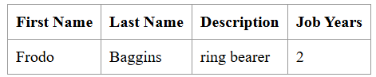

# CA1 - Part1: Version control with Git - Technical Report

Author: Ana Paula Lopes Nestor

Programme: SWitCH DEV

Course: DevOps

## Introduction

This section of the report details the version control practices applied throughout Part 1 of CA1. The task was divided into two distinct parts: **part 1.1**, where version control was managed without branches, and **part 1.2**, which involved the use of Git branches to implement new features and address bugs.  
In **part 1.1**, the focus was on adding a new feature (the jobYears field) to the application, with changes made directly to the main branch. This process involved editing the Employee class to incorporate the new field, along with adding validation logic and unit tests to ensure proper functionality. In **part 1.2**, I was able to use Git branches and understand how to better manage the development process by using them. Two separate branches were created: one for adding an email field to the application, and another to fix a bug related to email validation (ensuring the presence of the "@" symbol in the email address). As what was done in part 1.1 unit tests were also written for both new features, and debugging was performed to ensure everything functioned correctly. Finally, the changes were merged back into the main branch.

## Setup and configuration

To begin the assignment, a repository containing the **Tutorial React.js and Spring Data REST** application was cloned into a local folder on my computer (devops). The next step was to set up my own repository, which would host the class assignments and allow me to keep track of all modifications and improvements made.

**Setting up my repository:**  

To start, I created a repository on GitHub. Then, using Git Bash, I cloned this repository into a folder that I had previously created to store my DevOps project (ProjetoDevOps). The command used to clone the repository was as follows:  

```
git clone <repository-URL> "C:\Users\paula\ProjetoDevOps"
```
  
This step allowed me to have a local copy of the repository on my machine.  
Alternatively, instead of cloning the repository, I could have created a new local repository using the **git init** command and then linked it to the remote repository.  

**Copying the basic folder of the Tutorial application:**  
  
After cloning the repository, I created the **CA1/part1** folders and I copied the basic folder from the Tutorial React.js and Spring Data REST application (which I had initially cloned into my devops folder) into my newly created folder.
I used the following command to perform this action:

```
cp -r "C:\Users\paula\devops\devops-spring-react\basic" "C:\Users\paula\ProjetoDevOps\devops-24-25-1241898\CA1\part1"
```  
**Creating .gitignore file and commiting changes:**  

Next, I created a .gitignore file using [this generator](https://www.toptal.com/developers/gitignore), which originates a list of files and directories that should be ignored by Git (e.g., system files, IDE settings). After adding this file to my project, I staged, committed, and pushed my changes to the remote repository with the following commands:  

```
git add .  
git commit -m "Created .gitignore and README.md"  
git push origin main  
```  

This process ensured that my repository was correctly initialized with the project files, including the .gitignore.  

**Issue tracking:**  

In order to structure the development process and keep track of tasks efficiently, I used GitHub Issues. Issues help document specific tasks, feature enhancements, bug fixes, making it easier to manage progress. They can be categorized using labels and can have assignees.  

To create an issue, I followed these steps:

* Navigated to the Issues tab in the GitHub repository.
* Clicked on New Issue.
* Provided a title, description and assignee to define the task.
* Added a label to categorize the issue.

For the **part 1.1** of this assignment, I created two issues:

  

By using issues, I maintained an organized workflow and ensured that key tasks were well-documented.  
For the **part 1.2**, two issues were also created.

## Part 1.1 : Version control without branches  

**Main goals:**  

The first part of the assignment focused on basic version control operations without branching. After setting up the project, I was able to make changes directly in the main branch and track the development process via commits and version tags. The learning process involved adding a new field (jobYears) to the Employee class and developing unit tests in order to test the creation of Employees and the validation of their attributes whilst tracking the development of the project by tagging different versions. In version control, **tags** are used to mark specific points in the repository’s history, such as releases or feature completions.
In this assignment, tags were used to mark important stages in the development process, such as the **initial version** and the **version after adding the new feature and tests**, allowing for easy reference to the initial setup and later updates.  

**Implementation Details:**  

After creating the CA1/part1 folders, copying the basic folder from the Tutorial React.js and Spring Data REST application, I commited and pushed the changes to the main branch. At this point I **tagged the initial version as v1.1.0**, following the major.minor.revision pattern. This tag marks the starting point for the project.
To creat and push the version tag to the remote repository the following commands were used:  

```
git tag v1.1.0
git push origin v1.1.0
```  

The following step was the implementation of the new field, **jobYears**, that keeps track of the number of years the employee has worked in the company. Unit tests were also developed in order to test the correct creation of Employee objects and the validation of their attributes, guaranteeing they were valid (the jobYears field could only accept non-negative integers and the String fields could not be null or empty).
To incorporate the new feature the following files were changed:  

* **Employee.java**: The jobYears field was added, along with its getter and setter methods and methods to validate the Employee objects attributes. Below are the major changes made to incorporate the new functionality in the code:  

```
    public Employee(String firstName, String lastName, String description, Integer jobYears) {

		if(areParametersValid(firstName, "First name"))
			this.firstName = firstName;

		if(areParametersValid(lastName, "Last name"))
			this.lastName = lastName;

		if(areParametersValid(description, "Description"))
			this.description = description;

		if(isJobYearsValid(jobYears))
			this.jobYears = jobYears;
	}

	private boolean areParametersValid(String parameter, String fieldName) {

		if(parameter == null || parameter.isBlank())
			throw new IllegalArgumentException(fieldName + " cannot be null or empty!");

		return true;
	}

	private boolean isJobYearsValid(Integer jobYears) {

		if(jobYears == null || jobYears < 0)
			throw new IllegalArgumentException("Job Years must be a positive number!");

		return true;
	}
	
	public int getJobYears() { return jobYears; }

	public void setJobYears(int jobYears) { this.jobYears = jobYears; }
	
```  

* **EmployeeTest.java**: This class was created as part of the newly established **test** directory, since prior to this, no tests existed for the class. The tests developed validate the functionality of the Employee constructor and ensure the correct validation of the Employee objects attributes. By validating each version, tests help to ensure that each update maintains system integrity.
 Two tests were developed in order to check that the Employee constructor correctly creates Employee objects when valid parameters are provided, including an edge case with 0 years.  

```
@Test
    void shouldCreateEmployee() {

        //act
        Employee employee1 = new Employee("John", "Doe", "Developer", 5);
        Employee employee2 = new Employee("John", "Doe", "Developer", 0);

        //assert
        assertNotNull(employee1);
        assertNotNull(employee2);

    }
```  

 To test invalid parameters, parameterized tests were used in order to validate that the Employee constructor would correctly throw an IllegalArgumentException when invalid inputs were provided. This test checks multiple invalid scenarios such as null, empty, or blank values for firstName, lastName, or description and invalid values for jobYears, including null and negative numbers. Each invalid combination is expected to throw an exception with a specific message as seen below:  

```
    public static Stream<Arguments> provideInvalidParameters() {
        return Stream.of(
                arguments(null, "Doe", "Developer", 5, "First name cannot be null or empty!"),
                arguments("", "Doe", "Developer", 5, "First name cannot be null or empty!"),
                arguments(" ", "Doe", "Developer", 5, "First name cannot be null or empty!"),
                arguments("John", null, "Developer", 5, "Last name cannot be null or empty!"),
                arguments("John", "", "Developer", 5, "Last name cannot be null or empty!"),
                arguments("John", " ", "Developer", 5, "Last name cannot be null or empty!"),
                arguments("John", "Doe", null, 5, "Description cannot be null or empty!"),
                arguments("John", "Doe", "", 5, "Description cannot be null or empty!"),
                arguments("John", "Doe", " ", 5, "Description cannot be null or empty!"),
                arguments("John", "Doe", "Developer", null, "Job Years must be a positive number!"),
                arguments("John", "Doe", "Developer", -1, "Job Years must be a positive number!")
        );
    }
    @ParameterizedTest
    @MethodSource("provideInvalidParameters")
    void shouldReturnAnExceptionIfTheParametersAreInvalid(String firstName, String lastName, String description, Integer jobYears, String expectedMessage) {
        //arrange

        //act
        Exception exception = assertThrows(IllegalArgumentException.class, () -> new Employee(firstName, lastName, description, jobYears));

        //assert
        assertEquals(exception.getMessage(), expectedMessage);
    }
```  

* **DatabaseLoader.java**: The class was updated to include the jobYears field when saving sample employee data into the database. This modification ensures that the initial employee records include the number of years each employee has worked at the company, allowing the application to demonstrate this feature as soon as it runs:

```
@Override
	public void run(String... strings) throws Exception {// <4>
		this.repository.save(new Employee("Frodo", "Baggins", "ring bearer", 2));
	}
```  

* **app.js**: React components were updated to display the new jobYears field, allowing users to also see, after this update, the number of years an employee has been working in the company. 
 Below are the changes made to incorporate the new field into the application's frontend:  

```
class EmployeeList extends React.Component{
	render() {
		const employees = this.props.employees.map(employee =>
			<Employee key={employee._links.self.href} employee={employee}/>
		);
		return (
			<table>
				<tbody>
				<tr>
					<th>First Name</th>
					<th>Last Name</th>
					<th>Description</th>
					<th>Job Years</th>
				</tr>
				{employees}
				</tbody>
			</table>
		)
	}
}

class Employee extends React.Component{
	render() {
		return (
			<tr>
				<td>{this.props.employee.firstName}</td>
				<td>{this.props.employee.lastName}</td>
				<td>{this.props.employee.description}</td>
				<td>{this.props.employee.jobYears}</td>
			</tr>
		)
	}
}
```  

After implementing the jobYears feature, I ran the application using **./mvnw spring-boot:run** to test its real-time functionality at `http://localhost:8080/`. This allowed me to ensure that the new feature was correctly displayed in the user interface, as seen in the image below:  


In addition to testing the backend, I focused on **debugging the frontend** by opening the browser's developer tools and inspecting the console. This step was essential to verify the correct rendering of the jobYears field in the employee list. Below is an image showing the console output:  
  

Once the new feature was thoroughly tested and verified, the changes were committed to the repository. To indicate the completion of this feature, the version was **tagged as v1.2.0**, using the following commands:  

```
git tag v1.2.0
git push origin v1.2.0
```  

After tagging the updated version of the project, a commit was made to close the issues related to this part of the assignment. The commit message was configured to automatically close the issues on GitHub using the keyword Fixes #1 and #2, as shown in the command below:

```
git commit -m "Fixes #1 and #2: Update README.md and resolve issues"
```  
The repository was also **tagged with ca1-part1.1** to signify the completion of this phase of the assignment.  

## Part 1.2 : Version control with branches  

**Main goals:**  

The second part of this assignment involved working with Git branches to implement new features and fix bugs. The main tasks involved creating branches for the addition of a new email field and for fixing a bug related to email validation, as well as writing tests to verify the integrity of the code after the changes made.
To complete the assignment **two branches** were created. The first one, **email-field**, was used to implement the new email field in the application, ensuring the proper validation for employee creation. The second one, **fix-invalid-email**, was created to fix bugs related to invalid email entries, ensuring that the server only accepts employees with a valid email format (containing the "@" symbol).
Similarly to what was done in part 1.1 of the assignment, the development of the project was tracked using tags.  

**Implementation Details:**  

The first step in the process was the creation of a new Git branch dedicated to implementing the email field feature. This was done by creating a new branch and pushing it to the remote repository. The commands used were:  
```
git checkout -b email-field
git push -u origin email-field
```  
Once the branch was created and pushed to the repository, I proceeded with the necessary changes to implement the email field and its corresponding validation, as well as the unit tests for the validation of the new attribute. For details of the implementation, such as the files modified and the logic applied, I refer to the previous part of the assignment (part 1.1) as the process was very similar.  
Once the email field and validation were implemented, I tested both the backend and frontend to ensure proper functionality. Similar to the process in part 1.1, I performed debugging on both the server and client sides.  
The next step was to **merge the email-field branch into the main branch**. This ensures that the changes made in the feature branch are incorporated into the main branch.  
First, the changes made were committed using the following commands:  
```
git add .
git commit -m "Fixes #3: Finalized email field feature + tests"
```  
After committing the changes, I switched to the main branch to prepare for merging:  
```
git checkout main
```  
The following command merges the email-field branch into the main branch:
```
git merge email-field --no-ff
```  
The --no-ff option was used to ensure a **non-fast-forward merge**, preserving the branch history.  
Finally, the changes made were pushed to the repository and a new tag was created:
```
git push origin main
git tag v1.3.0
git push origin v1.3.0
```  
The process of creating the **fix-invalid-email** branch followed a very similar approach to the one used for the previous branch. As with the email-field branch, I created a separate branch dedicated to addressing the specific bug of invalid email validation. The implementation for the email validation and its corresponding tests was also quite similar to the previous one, with the focus being on ensuring that the email field correctly validated the presence of the "@" symbol.  
The **debugging** process for the fix-invalid-email branch was similar to the one performed in the email-field branch. In this case, I focused on testing the email validation directly in the DatabaseLoader class to ensure that the system correctly handled invalid email entries (emails without the "@" symbol). To do this, I added a test case with an invalid email in the DatabaseLoader and attempted to load the data. Upon running the application, the system produced an error message indicating that the email was invalid, confirming that the validation logic was functioning properly:
```
@Override
public void run(String... strings) throws Exception {
     this.repository.save(new Employee("Frodo", "Baggins", "ring bearer", 2, "frodobaggins@gmail.com"));
     this.repository.save(new Employee("Samwise", "Gamgee", "assistent", 2, "samwisegamgeegmail.com"));
}
```  
The error message displayed in the terminal was the following:
  

After merging the branches and pushing the changes a new tag was created:  
```
git tag v1.3.1
git push origin v1.3.1
``` 
At the end of the assignment, the repository was **tagged with ca1-part1.2**.  

## Alternative solution

**Git vs SVN**:

An alternative solution to Git for version control is Apache Subversion (SVN), which is a centralized version control system, contrasting with the distributed model that Git follows. This means that in Git, every user has a complete copy of the repository, including the entire version history, allowing commits to be made locally before pushing changes to a remote repository. In contrast, SVN relies on a central server to store all changes, requiring commits to be sent directly to the server without maintaining a local commit history. This ensures that the latest changes are always available to all team members but also means that users must frequently update their working copies to integrate changes made by others.
SVN tracks changes at the file level, whereas Git tracks snapshots of the entire project. This fundamental difference affects performance, with Git making things quicker and more efficient for teams working in different locations as most operations (such as commit, branch, and merge) occur locally, without needing constant communication with a central server. SVN, on the other hand, keeps everything in one central place, which can make it easier to manage and control changes, but requires more frequent communication with the server.
Branching also differs significantly between the two systems. Unlike Git, where branches are seamlessly integrated, SVN branches exist as separate directories within the repository. Users must manually merge branches when integrating changes, making the process more complex compared to Git’s automated merging capabilities. Additionally, Git enables users to work offline and commit changes locally before syncing, while SVN requires an active connection to the server for committing changes.

**Using SVN for the Assignment**:

The next section describes the commands that can be used to implement the alternative design:

* Setting up the repository: The following command crates a new SVN repository at the specified path on the server, setting up the necessary directory structure:
```
svnadmin create /path/to/repository
```

* Copying the basic folder of the Tutorial application: The next step is to import the basic folder from the Tutorial React.js and Spring Data REST application into the SVN repository. This can be done using the following commands:
```
cd /path/to/TutorialReactSpringDataREST
svn import ./basic file:///path/to/svn_repository/my_project -m "Importing basic folder from tutorial"

```
* Commiting changes: To commit changes (for example, after developing the jobYears field) the following steps should be used:
```
svn add .
svn commit -m "Commit message"
```
* Creating tags: Tags can also be created in SNV by copying the contents of the trunk directory (the main development branch) to a new folder under tags. The following command shows the creation of the **tag v1.2.0**, which marks the version of the assignment after adding the jobYears field and unit tests for testing the creation of Employees and validation of their attributes:
```
svn copy file:///path/to/svn_repository/my_project/trunk file:///path/to/svn_repository/my_project/tags/v1.2.0 -m "Tagging version 1.2.0"
```
* Branches:  In SVN, branches are simply copies of the repository stored under a specific directory structure. To create a new branch for implementing a feature (e.g., adding an email field to the Employee class), the following command can be used:
```
svn copy file:///path/to/svn_repository/my_project/trunk file:///path/to/svn_repository/my_project/branches/email-feature -m "Creating a branch for email feature"
```  
 This command duplicates the trunk (the main branch) into a new branch named email-feature.
 The following command can be used to switch to the newly created branch:  
```
svn switch file:///path/to/svn_repository/my_project/branches/email-feature
```
 Once the feature is complete and tested, it can be merged back into the main development branch (trunk) using:
```
svn checkout file:///path/to/svn_repository/my_project/trunk ./trunk
cd trunk
svn merge file:///path/to/svn_repository/my_project/branches/email-feature
svn commit -m "Merging email feature into trunk"
```  
In summary, while SVN offers a centralized and structured approach to version control, Git’s distributed model provides greater flexibility and efficiency, making the choice between them dependent on the project’s needs and collaboration style.  

## Conclusions

Working on the **Version Control with Git** assignment has given me valuable insights into version control systems and their impact on software development.
Completing **part 1.1** of this assignment provided a solid foundation in version control with Git, emphasizing essential concepts such as committing changes, tagging versions. By working directly in the master branch, I gained a deeper understanding of how incremental changes contribute to a structured and traceable development process. One fundamental insight was the **importance of tags in version control**. By tagging specific points in the repository, such as initial releases and feature updates, it becomes easier to track progress, and reference stable versions. Additionally, the introduction of GitHub **issues** highlighted an effective way to track and manage tasks throughout development.  
In **part 1.2**, I learned how to use Git branches, which helped me understand structured development better. Creating separate branches for new features and bug fixes made it easier to work on different tasks at the same time while keeping the main branch stable. This approach ensures that different aspects of the project can evolve independently. Merging branches also showed me how changes can be integrated in a controlled way, ensuring that each update is tested and reviewed before being added to the main project. I was also able to understand how using branches helps maintain a clear project history, making it easier to trace the progression of features and bug fixes.  
This assignment improved my technical skills with Git and deepened my understanding of distributed version control systems. It also introduced me to SVN, a centralized version control system, and highlighted the main differences between it and Git. Overall, this experience not only improved my technical skills but also showed me how important version control is for keeping code reliable and managing software development.