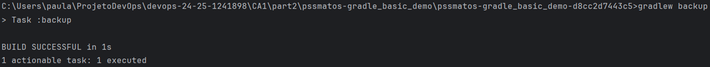
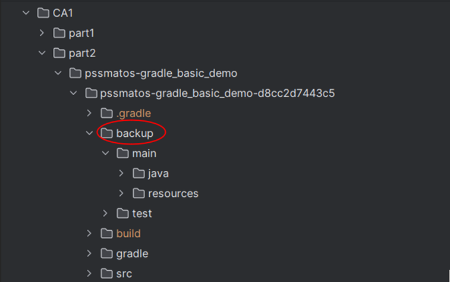
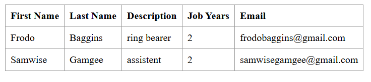
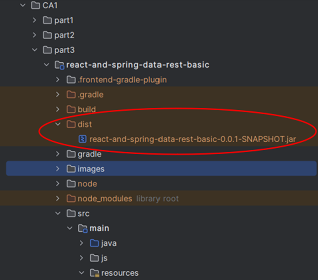
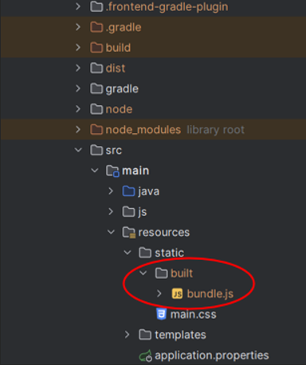
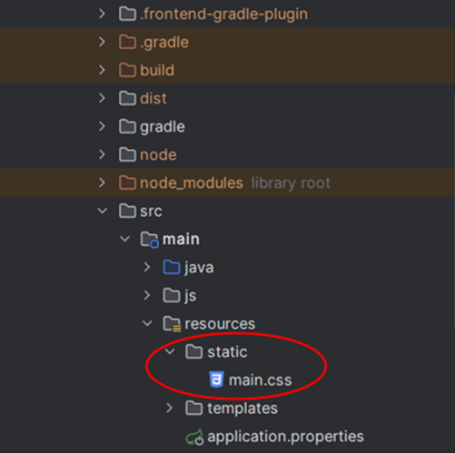

# CA1 - Part1: Version control with Git - Technical Report

Author: Ana Paula Lopes Nestor

Programme: SWitCH DEV

Course: DevOps

## Table of contents
1. [Introduction](#introduction)
2. [Setup and Configuration](#setup-and-configuration)
3. [Part 1.1: Version Control Without Branches](#part-11--version-control-without-branches-)
4. [Part 1.2: Version Control with Branches](#part-12--version-control-with-branches-)
5. [Alternative Solution](#alternative-solution)
6. [Conclusions](#conclusions)

## Introduction

This section of the report details the version control practices applied throughout Part 1 of CA1. The task was divided into two distinct parts: **part 1.1**, where version control was managed without branches, and **part 1.2**, which involved the use of Git branches to implement new features and address bugs.  
In **part 1.1**, the focus was on adding a new feature (the jobYears field) to the application, with changes made directly to the main branch. This process involved editing the Employee class to incorporate the new field, along with adding validation logic and unit tests to ensure proper functionality. In **part 1.2**, I was able to use Git branches and understand how to better manage the development process by using them. Two separate branches were created: one for adding an email field to the application, and another to fix a bug related to email validation (ensuring the presence of the "@" symbol in the email address). As what was done in part 1.1 unit tests were also written for both new features, and debugging was performed to ensure everything functioned correctly. Finally, the changes were merged back into the main branch.

## Setup and configuration

To begin the assignment, a repository containing the **Tutorial React.js and Spring Data REST** application was cloned into a local folder on my computer (devops). The next step was to set up my own repository, which would host the class assignments and allow me to keep track of all modifications and improvements made.

**Setting up my repository:**  

To start, I created a repository on GitHub. Then, using Git Bash, I cloned this repository into a folder that I had previously created to store my DevOps project (ProjetoDevOps). The command used to clone the repository was as follows:  

```
git clone <repository-URL> "C:\Users\paula\ProjetoDevOps"
```
  
This step allowed me to have a local copy of the repository on my machine.  
Alternatively, instead of cloning the repository, I could have created a new local repository using the **git init** command and then linked it to the remote repository.  

**Copying the basic folder of the Tutorial application:**  
  
After cloning the repository, I created the **CA1/part1** folders and I copied the basic folder from the Tutorial React.js and Spring Data REST application (which I had initially cloned into my devops folder) into my newly created folder.
I used the following command to perform this action:

```
cp -r "C:\Users\paula\devops\devops-spring-react\basic" "C:\Users\paula\ProjetoDevOps\devops-24-25-1241898\CA1\part1"
```  
**Creating .gitignore file and commiting changes:**  

Next, I created a .gitignore file using [this generator](https://www.toptal.com/developers/gitignore), which originates a list of files and directories that should be ignored by Git (e.g., system files, IDE settings). After adding this file to my project, I staged, committed, and pushed my changes to the remote repository with the following commands:  

```
git add .  
git commit -m "Created .gitignore and README.md"  
git push origin main  
```  

This process ensured that my repository was correctly initialized with the project files, including the .gitignore.  

**Issue tracking:**  

In order to structure the development process and keep track of tasks efficiently, I used GitHub Issues. Issues help document specific tasks, feature enhancements, bug fixes, making it easier to manage progress. They can be categorized using labels and can have assignees.  

To create an issue, I followed these steps:

* Navigated to the Issues tab in the GitHub repository.
* Clicked on New Issue.
* Provided a title, description and assignee to define the task.
* Added a label to categorize the issue.

For the **part 1.1** of this assignment, I created two issues:

  

By using issues, I maintained an organized workflow and ensured that key tasks were well-documented.  
For the **part 1.2**, two issues were also created.

## Part 1.1 : Version control without branches  

**Main goals:**  

The first part of the assignment focused on basic version control operations without branching. After setting up the project, I was able to make changes directly in the main branch and track the development process via commits and version tags. The learning process involved adding a new field (jobYears) to the Employee class and developing unit tests in order to test the creation of Employees and the validation of their attributes whilst tracking the development of the project by tagging different versions. In version control, **tags** are used to mark specific points in the repository’s history, such as releases or feature completions.
In this assignment, tags were used to mark important stages in the development process, such as the **initial version** and the **version after adding the new feature and tests**, allowing for easy reference to the initial setup and later updates.  

**Implementation Details:**  

After creating the CA1/part1 folders, copying the basic folder from the Tutorial React.js and Spring Data REST application, I commited and pushed the changes to the main branch. At this point I **tagged the initial version as v1.1.0**, following the major.minor.revision pattern. This tag marks the starting point for the project.
To creat and push the version tag to the remote repository the following commands were used:  

```
git tag v1.1.0
git push origin v1.1.0
```  

The following step was the implementation of the new field, **jobYears**, that keeps track of the number of years the employee has worked in the company. Unit tests were also developed in order to test the correct creation of Employee objects and the validation of their attributes, guaranteeing they were valid (the jobYears field could only accept non-negative integers and the String fields could not be null or empty).
To incorporate the new feature the following files were changed:  

* **Employee.java**: The jobYears field was added, along with its getter and setter methods and methods to validate the Employee objects attributes. Below are the major changes made to incorporate the new functionality in the code:  

```
    public Employee(String firstName, String lastName, String description, Integer jobYears) {

		if(areParametersValid(firstName, "First name"))
			this.firstName = firstName;

		if(areParametersValid(lastName, "Last name"))
			this.lastName = lastName;

		if(areParametersValid(description, "Description"))
			this.description = description;

		if(isJobYearsValid(jobYears))
			this.jobYears = jobYears;
	}

	private boolean areParametersValid(String parameter, String fieldName) {

		if(parameter == null || parameter.isBlank())
			throw new IllegalArgumentException(fieldName + " cannot be null or empty!");

		return true;
	}

	private boolean isJobYearsValid(Integer jobYears) {

		if(jobYears == null || jobYears < 0)
			throw new IllegalArgumentException("Job Years must be a positive number!");

		return true;
	}
	
	public int getJobYears() { return jobYears; }

	public void setJobYears(int jobYears) { this.jobYears = jobYears; }
	
```  

* **EmployeeTest.java**: This class was created as part of the newly established **test** directory, since prior to this, no tests existed for the class. The tests developed validate the functionality of the Employee constructor and ensure the correct validation of the Employee objects attributes. By validating each version, tests help to ensure that each update maintains system integrity.
 Two tests were developed in order to check that the Employee constructor correctly creates Employee objects when valid parameters are provided, including an edge case with 0 years.  

```
@Test
    void shouldCreateEmployee() {

        //act
        Employee employee1 = new Employee("John", "Doe", "Developer", 5);
        Employee employee2 = new Employee("John", "Doe", "Developer", 0);

        //assert
        assertNotNull(employee1);
        assertNotNull(employee2);

    }
```  

 To test invalid parameters, parameterized tests were used in order to validate that the Employee constructor would correctly throw an IllegalArgumentException when invalid inputs were provided. This test checks multiple invalid scenarios such as null, empty, or blank values for firstName, lastName, or description and invalid values for jobYears, including null and negative numbers. Each invalid combination is expected to throw an exception with a specific message as seen below:  

```
    public static Stream<Arguments> provideInvalidParameters() {
        return Stream.of(
                arguments(null, "Doe", "Developer", 5, "First name cannot be null or empty!"),
                arguments("", "Doe", "Developer", 5, "First name cannot be null or empty!"),
                arguments(" ", "Doe", "Developer", 5, "First name cannot be null or empty!"),
                arguments("John", null, "Developer", 5, "Last name cannot be null or empty!"),
                arguments("John", "", "Developer", 5, "Last name cannot be null or empty!"),
                arguments("John", " ", "Developer", 5, "Last name cannot be null or empty!"),
                arguments("John", "Doe", null, 5, "Description cannot be null or empty!"),
                arguments("John", "Doe", "", 5, "Description cannot be null or empty!"),
                arguments("John", "Doe", " ", 5, "Description cannot be null or empty!"),
                arguments("John", "Doe", "Developer", null, "Job Years must be a positive number!"),
                arguments("John", "Doe", "Developer", -1, "Job Years must be a positive number!")
        );
    }
    @ParameterizedTest
    @MethodSource("provideInvalidParameters")
    void shouldReturnAnExceptionIfTheParametersAreInvalid(String firstName, String lastName, String description, Integer jobYears, String expectedMessage) {
        //arrange

        //act
        Exception exception = assertThrows(IllegalArgumentException.class, () -> new Employee(firstName, lastName, description, jobYears));

        //assert
        assertEquals(exception.getMessage(), expectedMessage);
    }
```  

* **DatabaseLoader.java**: The class was updated to include the jobYears field when saving sample employee data into the database. This modification ensures that the initial employee records include the number of years each employee has worked at the company, allowing the application to demonstrate this feature as soon as it runs:

```
@Override
	public void run(String... strings) throws Exception {// <4>
		this.repository.save(new Employee("Frodo", "Baggins", "ring bearer", 2));
	}
```  

* **app.js**: React components were updated to display the new jobYears field, allowing users to also see, after this update, the number of years an employee has been working in the company. 
 Below are the changes made to incorporate the new field into the application's frontend:  

```
class EmployeeList extends React.Component{
	render() {
		const employees = this.props.employees.map(employee =>
			<Employee key={employee._links.self.href} employee={employee}/>
		);
		return (
			<table>
				<tbody>
				<tr>
					<th>First Name</th>
					<th>Last Name</th>
					<th>Description</th>
					<th>Job Years</th>
				</tr>
				{employees}
				</tbody>
			</table>
		)
	}
}

class Employee extends React.Component{
	render() {
		return (
			<tr>
				<td>{this.props.employee.firstName}</td>
				<td>{this.props.employee.lastName}</td>
				<td>{this.props.employee.description}</td>
				<td>{this.props.employee.jobYears}</td>
			</tr>
		)
	}
}
```  

After implementing the jobYears feature, I ran the application using **./mvnw spring-boot:run** to test its real-time functionality at `http://localhost:8080/`. This allowed me to ensure that the new feature was correctly displayed in the user interface, as seen in the image below:  


In addition to testing the backend, I focused on **debugging the frontend** by opening the browser's developer tools and inspecting the console. This step was essential to verify the correct rendering of the jobYears field in the employee list. Below is an image showing the console output:  
  

Once the new feature was thoroughly tested and verified, the changes were committed to the repository. To indicate the completion of this feature, the version was **tagged as v1.2.0**, using the following commands:  

```
git tag v1.2.0
git push origin v1.2.0
```  

After tagging the updated version of the project, a commit was made to close the issues related to this part of the assignment. The commit message was configured to automatically close the issues on GitHub using the keyword Fixes #1 and #2, as shown in the command below:

```
git commit -m "Fixes #1 and #2: Update README.md and resolve issues"
```  
The repository was also **tagged with ca1-part1.1** to signify the completion of this phase of the assignment.  

## Part 1.2 : Version control with branches  

**Main goals:**  

The second part of this assignment involved working with Git branches to implement new features and fix bugs. The main tasks involved creating branches for the addition of a new email field and for fixing a bug related to email validation, as well as writing tests to verify the integrity of the code after the changes made.
To complete the assignment **two branches** were created. The first one, **email-field**, was used to implement the new email field in the application, ensuring the proper validation for employee creation. The second one, **fix-invalid-email**, was created to fix bugs related to invalid email entries, ensuring that the server only accepts employees with a valid email format (containing the "@" symbol).
Similarly to what was done in part 1.1 of the assignment, the development of the project was tracked using tags.  

**Implementation Details:**  

The first step in the process was the creation of a new Git branch dedicated to implementing the email field feature. This was done by creating a new branch and pushing it to the remote repository. The commands used were:  
```
git checkout -b email-field
git push -u origin email-field
```  
Once the branch was created and pushed to the repository, I proceeded with the necessary changes to implement the email field and its corresponding validation, as well as the unit tests for the validation of the new attribute. For details of the implementation, such as the files modified and the logic applied, I refer to the previous part of the assignment (part 1.1) as the process was very similar.  
Once the email field and validation were implemented, I tested both the backend and frontend to ensure proper functionality. Similar to the process in part 1.1, I performed debugging on both the server and client sides.  
The next step was to **merge the email-field branch into the main branch**. This ensures that the changes made in the feature branch are incorporated into the main branch.  
First, the changes made were committed using the following commands:  
```
git add .
git commit -m "Fixes #3: Finalized email field feature + tests"
```  
After committing the changes, I switched to the main branch to prepare for merging:  
```
git checkout main
```  
The following command merges the email-field branch into the main branch:
```
git merge email-field --no-ff
```  
The --no-ff option was used to ensure a **non-fast-forward merge**, preserving the branch history.  
Finally, the changes made were pushed to the repository and a new tag was created:
```
git push origin main
git tag v1.3.0
git push origin v1.3.0
```  
The process of creating the **fix-invalid-email** branch followed a very similar approach to the one used for the previous branch. As with the email-field branch, I created a separate branch dedicated to addressing the specific bug of invalid email validation. The implementation for the email validation and its corresponding tests was also quite similar to the previous one, with the focus being on ensuring that the email field correctly validated the presence of the "@" symbol.  
The **debugging** process for the fix-invalid-email branch was similar to the one performed in the email-field branch. In this case, I focused on testing the email validation directly in the DatabaseLoader class to ensure that the system correctly handled invalid email entries (emails without the "@" symbol). To do this, I added a test case with an invalid email in the DatabaseLoader and attempted to load the data. Upon running the application, the system produced an error message indicating that the email was invalid, confirming that the validation logic was functioning properly:
```
@Override
public void run(String... strings) throws Exception {
     this.repository.save(new Employee("Frodo", "Baggins", "ring bearer", 2, "frodobaggins@gmail.com"));
     this.repository.save(new Employee("Samwise", "Gamgee", "assistent", 2, "samwisegamgeegmail.com"));
}
```  
The error message displayed in the terminal was the following:
  

After merging the branches and pushing the changes a new tag was created:  
```
git tag v1.3.1
git push origin v1.3.1
``` 
At the end of the assignment, the repository was **tagged with ca1-part1.2**.  

## Alternative solution

**Git vs SVN**:

An alternative solution to Git for version control is Apache Subversion (SVN), which is a centralized version control system, contrasting with the distributed model that Git follows. This means that in Git, every user has a complete copy of the repository, including the entire version history, allowing commits to be made locally before pushing changes to a remote repository. In contrast, SVN relies on a central server to store all changes, requiring commits to be sent directly to the server without maintaining a local commit history. This ensures that the latest changes are always available to all team members but also means that users must frequently update their working copies to integrate changes made by others.
SVN tracks changes at the file level, whereas Git tracks snapshots of the entire project. This fundamental difference affects performance, with Git making things quicker and more efficient for teams working in different locations as most operations (such as commit, branch, and merge) occur locally, without needing constant communication with a central server. SVN, on the other hand, keeps everything in one central place, which can make it easier to manage and control changes, but requires more frequent communication with the server.
Branching also differs significantly between the two systems. Unlike Git, where branches are seamlessly integrated, SVN branches exist as separate directories within the repository. Users must manually merge branches when integrating changes, making the process more complex compared to Git’s automated merging capabilities. Additionally, Git enables users to work offline and commit changes locally before syncing, while SVN requires an active connection to the server for committing changes.

**Using SVN for the Assignment**:

The next section describes the commands that can be used to implement the alternative design:

* Setting up the repository: The following command crates a new SVN repository at the specified path on the server, setting up the necessary directory structure:
```
svnadmin create /path/to/repository
```

* Copying the basic folder of the Tutorial application: The next step is to import the basic folder from the Tutorial React.js and Spring Data REST application into the SVN repository. This can be done using the following commands:
```
cd /path/to/TutorialReactSpringDataREST
svn import ./basic file:///path/to/svn_repository/my_project -m "Importing basic folder from tutorial"

```
* Commiting changes: To commit changes (for example, after developing the jobYears field) the following steps should be used:
```
svn add .
svn commit -m "Commit message"
```
* Creating tags: Tags can also be created in SNV by copying the contents of the trunk directory (the main development branch) to a new folder under tags. The following command shows the creation of the **tag v1.2.0**, which marks the version of the assignment after adding the jobYears field and unit tests for testing the creation of Employees and validation of their attributes:
```
svn copy file:///path/to/svn_repository/my_project/trunk file:///path/to/svn_repository/my_project/tags/v1.2.0 -m "Tagging version 1.2.0"
```
* Branches:  In SVN, branches are simply copies of the repository stored under a specific directory structure. To create a new branch for implementing a feature (e.g., adding an email field to the Employee class), the following command can be used:
```
svn copy file:///path/to/svn_repository/my_project/trunk file:///path/to/svn_repository/my_project/branches/email-feature -m "Creating a branch for email feature"
```  
 This command duplicates the trunk (the main branch) into a new branch named email-feature.
 The following command can be used to switch to the newly created branch:  
```
svn switch file:///path/to/svn_repository/my_project/branches/email-feature
```
 Once the feature is complete and tested, it can be merged back into the main development branch (trunk) using:
```
svn checkout file:///path/to/svn_repository/my_project/trunk ./trunk
cd trunk
svn merge file:///path/to/svn_repository/my_project/branches/email-feature
svn commit -m "Merging email feature into trunk"
```  
In summary, while SVN offers a centralized and structured approach to version control, Git’s distributed model provides greater flexibility and efficiency, making the choice between them dependent on the project’s needs and collaboration style.  

## Conclusions

Working on the **Version Control with Git** assignment has given me valuable insights into version control systems and their impact on software development.
Completing **part 1.1** of this assignment provided a solid foundation in version control with Git, emphasizing essential concepts such as committing changes, tagging versions. By working directly in the master branch, I gained a deeper understanding of how incremental changes contribute to a structured and traceable development process. One fundamental insight was the **importance of tags in version control**. By tagging specific points in the repository, such as initial releases and feature updates, it becomes easier to track progress, and reference stable versions. Additionally, the introduction of GitHub **issues** highlighted an effective way to track and manage tasks throughout development.  
In **part 1.2**, I learned how to use Git branches, which helped me understand structured development better. Creating separate branches for new features and bug fixes made it easier to work on different tasks at the same time while keeping the main branch stable. This approach ensures that different aspects of the project can evolve independently. Merging branches also showed me how changes can be integrated in a controlled way, ensuring that each update is tested and reviewed before being added to the main project. I was also able to understand how using branches helps maintain a clear project history, making it easier to trace the progression of features and bug fixes.  
This assignment improved my technical skills with Git and deepened my understanding of distributed version control systems. It also introduced me to SVN, a centralized version control system, and highlighted the main differences between it and Git. Overall, this experience not only improved my technical skills but also showed me how important version control is for keeping code reliable and managing software development.  

# CA1 - Part2: Build Tools with Gradle - Technical Report  

## Table of contents
1. [Introduction](#introduction)
2. [Setup and Configuration](#setup-and-configuration)
3. [Gradle Basic Demo](#gradle-basic-demo-)
4. [runServer Task](#runserver-task-)
5. [Add a Unit Test](#add-a-unit-test-)
6. [backup Task](#backup-task-)
7. [archive Task](#archive-task-)
8. [Conclusion](#conclusion)

## Introduction  

This report provides an overview of the tasks carried out during the **part 2  of the CA1 assignment (Build Tools with Gradle)**. This part of the assignment is divided into two different stages, that aim to  offer a hands-on experience with Gradle. The first stage is focused on the initial environment setup, while the second stage covers more complex operations such as creating tasks and unit testing into the build process.  
The first part of the report explains how the **Gradle Basic Demo** (a multithreaded chat server) was implemented and tested. It shows the steps involved in building, launching, and connecting multiple clients to the server. The next part of the report describes how a new Gradle task was added to the project, demonstrating how Gradle can be extended to fit specific project needs and how a unit test was integrated to showcase how it improves the project's reliability by including unit tests in the build process. Finally, the report covers the addition of Copy and Zip tasks, which illustrate how Gradle can be used for managing files, an important aspect of project maintenance and distribution.  

## Setup and configuration  

**Copying the example application:** To begin the assignment, I used GitBash to create a folder called **part2** inside the CA1 folder. This was done using the following commands:
```
cd ProjetoDevOps/devops-24-25-141898/CA1
mkdir part2
```  
Next, I downloaded the example application from the Bitbucket repository to a folder on my computer and copied the contents of the repository into the part2 folder using the following command: 
```
cp -r "C:\Users\paula\OneDrive\Ambiente de Trabalho\pssmatos-gradle_basic_demo" "C:\Users\paula\ProjetoDevOps\devops-24-25-1241898\CA1\part2"
```  
Finally, I committed the changes to the remote repository:
```
git add .
git commit -m "Creation of folder part2 of CA1"
``` 

**Issue tracking:** As in part1 of the assignment, **issues** were created to track the progress of the tasks in part2. In this case, three issues were created, each corresponding to one of the main tasks required for this part of the assignment.  

## Gradle Basic Demo  

After reading the README file provided in the project, which explains how the application works, the next step was to test it. First, the following command was executed :
```
./gradlew build
``` 
This command compiled the source code and generated an executable .jar file, making the application ready to run. The image below shows the output of the build process, confirming that the build completed without errors:

  

Next, the following command was run in the terminal to start the chat server:
```
java -cp build/libs/basic_demo-0.1.0.jar basic_demo.ChatServerApp 59001
``` 
To test the client functionality, the command below was executed in both the Windows terminal and Git Bash:
```
./gradlew runClient
``` 
This command starts a chat client and connects it to the server, allowing interaction between multiple clients. The successful execution of these commands confirmed that the project was working as expected, as shown in the following images:  

  
  
  


## runServer Task 

In Gradle, tasks are used to **automate** various steps of a project, such as compiling, and running applications. By defining a set of instructions that Gradle executes when called, tasks help simplify repetitive actions in the development process.  
To make running the server easier, a new task called **runServer** was added to the **build.gradle** file. This task, of type **JavaExec**, allows the server to be started automatically with a single command. It depends on the classes task, ensuring that all necessary classes are compiled before the server starts. The task is configured to launch the ChatServerApp main class on port 59001. Below is the code I added to the build.gradle file to create the task:
```
task runServer(type: JavaExec, dependsOn: classes) {
    group = "DevOps"
    description = "Launches a chat server that listens on port 59001"

    classpath = sourceSets.main.runtimeClasspath

    mainClass = 'basic_demo.ChatServerApp'

    args '59001'
}
```  
The image bellow demonstrates the successful execution of the runServer task after executing the **./gradlew runServer** command:  

  

## Add a unit test  

I created a unit test to verify that the App class works as expected. This test is located in a new directory: src/test/java/basic_demo, in a file called AppTest.java. The purpose of the test is to **ensure that the App class provides a greeting message that is not null**. To make sure the project is set up for testing, I included the necessary JUnit dependency in the build.gradle file:
```
testImplementation 'junit:junit:4.12'
``` 
The test code in **AppTest.java**, which will be shown below, is designed to verify if the greeting message is provided correctly:
```
public class AppTest {
    @Test 
    public void testAppHasAGreeting() {
        App app = new App();
        assertNotNull("app should have a greeting", app.getGreeting());
    }
}
```  
Once the test was set up, I ran the **.\gradlew test** command to execute it. The terminal output from running the command, shown in the image below, confirms that the test was successful:

 

## backup Task 

The next task created and added to the build.gradle file was the backup task (facilitates the backup of the project's source code). This task, of **type Copy**, automatically copies the contents of the src folder into a new folder called backup. Below is the code I added to the build.gradle file in order to create the task:  
```
task backup(type:Copy){
    group = "DevOps"
    description = "Makes a backup of the sources of the application (copy of the contents of the src folder to a new backup folder)"

    from 'src'
    into 'backup'
}
```  
The image below demonstrates the successful execution of the **backup** task after running the **./gradlew backup** command:



Following the task execution, the backup folder was created successfully in the project directory, as shown in the next image:  

  

Since this folder is automatically generated by Gradle and can be recreated at any time by running the backup task again, the backup folder was not committed to the remote repository. To maintain a clean repository, the backup folder was excluded and added to the .gitignore file. This ensures that backup files are stored locally and do not interfere with the version-controlled codebase.  

## archive Task 

The final task involved creating a task of **type Zip**. This task helps simplify the process of creating an archive of the project's source code. This last task automates the process of zipping the contents of the src folder into a .zip file, which can be useful for backups or distribution. The task is configured to create the archive file as src_backup.zip and store it in the build directory. Below is the code I added to the build.gradle file to create the task:  
```
task archive(type: Zip) {
    group = "DevOps"
    description = "Make an archive of the sources of the application (copy the contents of the src folder to a new zip file)"

    from 'src'
    archiveFileName.set('src_backup.zip')
    destinationDirectory.set(file("$buildDir"))
}
```  
The following image shows that the task was successfully executed after running the command ./gradlew archive:  

  

The image bellow shows the src_backup.zip file created in the build directory after the execution of the command:  

 

As with the backup task, since the src_backup.zip file is automatically generated by Gradle and can be recreated at any time, it was excluded from the remote repository.  

At the end of the assignment, the repository was **tagged with ca1-part2**.

## Conclusion  

Completing this assignment helped me gain a better understanding of how Gradle can be used as a **build tool**. By creating tasks like **runServer**, **backup**, and **archive**, I automated important parts of the development process. Automating tasks makes the process faster, reduces the chances of mistakes, and saves time by avoiding manual work. Adding unit tests to the build process showed how automation can make testing easier and more reliable. Overall, this experience improved my knowledge of Gradle and how it can make development more efficient.  

# CA1 - Part3: Build Tools with Gradle - Technical Report  

## Table of contents
1. [Introduction](#introduction)
2. [Setup and Configuration](#setup-and-configuration)
3. [Integrating Existing Code](#integrating-existing-code-)
4. [Configuring Gradle to Manage Frontend](#configuring-gradle-to-manage-frontend-)
5. [Add Gradle Tasks: Task copyJar and Task cleanWebpack](#add-gradle-tasks-task-copyjar-and-task-cleanwebpack)
6. [Alternative Solution](#alternative-solution)
7. [Conclusion](#conclusion)

## Introduction  

This report provides a detailed explanation on the tasks completed in **part3 of CA1**, focusing on the transition from Maven (used in other parts of CA1) to **Gradle as a build automation tool**. This part of the assignment explores the advantages of Gradle over other tools and its role in optimizing the software development process.  
The report begins by outlining the process of setting up a new Spring Boot application using Gradle, detailing how the existing source code from part 1 of CA1 was incorporated into the new project structure. It then describes the integration of a plugin to manage the frontend, followed by the implementation of custom tasks that automate file management and improve project maintainability. Finally, the document explores another build automation tool.  

## Setup and configuration  

**Set up initial Gradle Project:** The setup began with the creation of the **part3** directory inside the **CA1 folder**. This was done using Git Bash with the following commands:  
```
cd ProjetoDevOps/devops-24-25-141898/CA1
mkdir part3
```  
The next step involved the creation of a new Git branch, **tut-basic-gradle**, to manage this part of the assignment:  
```
git checkout -b tut-basic-gradle
git push -u origin tut-basic-gradle
```  
Then a new **Spring Boot project** was initialized using **Gradle** as the build system. This was done by generating the project via [Spring Initializr](https://start.spring.io), downloading the ZIP file, and extracting it into the part3 directory.  
To verify the project setup and check the available Gradle tasks, the following command was executed:
```
./gradlew tasks
```  
The output of this command confirmed that the project has been set up correctly and that Gradle was working as expected: 
```
> Task :tasks

------------------------------------------------------------
Tasks runnable from root project 'react-and-spring-data-rest-basic'
------------------------------------------------------------

Application tasks
-----------------
bootRun - Runs this project as a Spring Boot application.
bootTestRun - Runs this project as a Spring Boot application using the test runtime classpath.

Build tasks
-----------
assemble - Assembles the outputs of this project.
bootBuildImage - Builds an OCI image of the application using the output of the bootJar task
bootJar - Assembles an executable jar archive containing the main classes and their dependencies.
build - Assembles and tests this project.
buildDependents - Assembles and tests this project and all projects that depend on it.
buildNeeded - Assembles and tests this project and all projects it depends on.
classes - Assembles main classes.
clean - Deletes the build directory.
jar - Assembles a jar archive containing the classes of the 'main' feature.
resolveMainClassName - Resolves the name of the application's main class.
resolveTestMainClassName - Resolves the name of the application's test main class.
testClasses - Assembles test classes.

Build Setup tasks
-----------------
init - Initializes a new Gradle build.
updateDaemonJvm - Generates or updates the Gradle Daemon JVM criteria.
wrapper - Generates Gradle wrapper files.

Documentation tasks
-------------------
javadoc - Generates Javadoc API documentation for the 'main' feature.

Frontend tasks
--------------
assembleFrontend - Assembles frontend artifacts by running a specific script.
checkFrontend - Checks frontend by running a specific script.
cleanFrontend - Cleans frontend resources outside the build directory by running a specific script.
installFrontend - Installs frontend dependencies.
installNode - Downloads and installs a Node.js distribution.
installPackageManager - Installs the package manager.
publishFrontend - Publishes frontend artifacts by running a specific script.
resolvePackageManager - Resolves the package manager.

Help tasks
----------
artifactTransforms - Displays the Artifact Transforms that can be executed in root project 'react-and-spring-data-rest-basic'.
buildEnvironment - Displays all buildscript dependencies declared in root project 'react-and-spring-data-rest-basic'.
dependencies - Displays all dependencies declared in root project 'react-and-spring-data-rest-basic'.
dependencyInsight - Displays the insight into a specific dependency in root project 'react-and-spring-data-rest-basic'.
dependencyManagement - Displays the dependency management declared in root project 'react-and-spring-data-rest-basic'.
help - Displays a help message.
javaToolchains - Displays the detected java toolchains.
outgoingVariants - Displays the outgoing variants of root project 'react-and-spring-data-rest-basic'.
projects - Displays the sub-projects of root project 'react-and-spring-data-rest-basic'.
properties - Displays the properties of root project 'react-and-spring-data-rest-basic'.
resolvableConfigurations - Displays the configurations that can be resolved in root project 'react-and-spring-data-rest-basic'.
tasks - Displays the tasks runnable from root project 'react-and-spring-data-rest-basic'.

Publishing tasks
----------------
publish - Publishes all publications produced by this project.

Verification tasks
------------------
check - Runs all checks.
test - Runs the test suite.

Rules
-----
Pattern: clean<TaskName>: Cleans the output files of a task.
Pattern: build<ConfigurationName>: Assembles the artifacts of a configuration.

To see all tasks and more detail, run gradlew tasks --all

To see more detail about a task, run gradlew help --task <task>

BUILD SUCCESSFUL in 25s
1 actionable task: 1 executed
```  
**Issue tracking:** As done in part1 and part2 of the assignment, **issues** were created to track the progress of the tasks in part3. In this case, three issues were created, each corresponding to one of the main tasks required for this part of the assignment.  

At this point in the project, the goal was to **integrate the existing codebase from the basic tutorial** into the newly created **Gradle project**. The process followed a systematic approach to ensure the integration was successful and the application functioned correctly within the new build system.  

## Integrating Existing Code  

The next step was to integrate the **src folder** from the basic tutorial into the Gradle project. The integration process followed these steps:  

**Delete the existing src folder:** The first step was to delete the existing src folder from the newly created Gradle project. This was done using the following command inside the project directory:  
```
rm -r src
```  
**Copy the src folder from the basic tutorial project:** The entire src folder, along with its subdirectories, was copied from the basic tutorial project to the new Gradle project. This was done with the following command:
```
cp -r "C:/Users/paula/ProjetoDevOps/devops-24-25-1241898/CA1/part1/basic/src" "C:/Users/paula/ProjetoDevOps/devops-24-25-1241898/CA1/part3/react-and-spring-data-rest-basic"
```  
**Copy necessary configuration files:** The essential configuration files, **webpack.config.js** and **package.json**, were copied into the root directory of the Gradle project. These files help manage the frontend build process and its dependencies. The following commands were used:  
```
cp "C:/Users/paula/ProjetoDevOps/devops-24-25-1241898/CA1/part1/basic/webpack.config.js" "C:/Users/paula/ProjetoDevOps/devops-24-25-1241898/CA1/part3/react-and-spring-data-rest-basic"
cp "C:/Users/paula/ProjetoDevOps/devops-24-25-1241898/CA1/part1/basic/package.json" "C:/Users/paula/ProjetoDevOps/devops-24-25-1241898/CA1/part3/react-and-spring-data-rest-basic"
```  
**Delete conflicting directory:** The **src/main/resources/static/built directory**, which would later be automatically generated by Webpack during the build process, was removed from the project to avoid any conflicts or redundancy:  
```
rm -r "C:/Users/paula/ProjetoDevOps/devops-24-25-1241898/CA1/part3/react-and-spring-data-rest-basic/src/main/resources/static/built"
```  
**Resolving compilation errors:** After migrating the code, a compilation issue was encountered. To address this, the Employee.java class was updated due to the transition from Java EE to Jakarta EE. Specifically, the import statements were modified from **javax.persistence** to **jakarta.persistencePP. Additionally, the **package.json** file was updated to specify a fixed version of the package manager, ensuring that the project would always use the same version of npm across different environments. The following line was added:  
```
"packageManager": "npm@9.6.7"
```  

**Testing the application:** After completing all necessary adjustments, the application was executed to verify its functionality. The command **./gradlew bootRun** was run to compile and launch the Spring Boot application. When accessing `http://localhost:8080/`, the page appeared blank. This was the expected outcome since the current Gradle configuration does not yet include the necessary plugin to process the frontend code. This issue will be addressed in the following section of this report.

## Configuring Gradle to Manage Frontend  

To integrate frontend management into the Gradle build process, the **org.siouan.frontend-gradle-plugin** was added. This plugin allows Gradle to handle **frontend dependencies** and tasks similarly to how the frontend-maven-plugin does in Maven-based projects.  
This particular project uses Java 17, so the dependency included in the plugins block of **build.gradle** was the following:
```
id "org.siouan.frontend-jdk17" version "8.0.0"
```  
To define how Gradle should manage frontend-related tasks, additional settings were added in **build.gradle** to specify the Node.js version and the scripts for building, cleaning, and checking the frontend:  
```
frontend {
    nodeVersion = "16.20.2"
    assembleScript = "run build"
    cleanScript = "run clean"
    checkScript = "run check"
}
```  
The scripts section in **package.json** was modified to define commands for Webpack execution and other frontend-related operations:  
```
"scripts": {
    "webpack": "webpack",
    "build": "npm run webpack",
    "check": "echo Checking frontend",
    "clean": "echo Cleaning frontend",
    "lint": "echo Linting frontend",
    "test": "echo Testing frontend"
}
```  
After completing these configurations, the command **./gradlew build** was executed, and I was able to confirm the project compiled successfully, including the frontend assets. The next step was the execution of the command **./gradlew bootRun** to start the Spring Boot application. Upon visiting `http://localhost:8080/` I was able to confirm the expected frontend content was displayed as shown in the image bellow:

This setup ensures that Gradle properly handles the frontend, allowing the project to run smoothly with both backend and frontend working together as expected.  

## Add Gradle Tasks: Task copyJar and Task cleanWebpack

To improve the build process and project management, **two custom Gradle tasks** were created. These tasks automate the handling of build artifacts and frontend files. Their purpose is to ensure that the necessary files are copied to the correct directories and that unnecessary files are cleaned up before each build.  

**copyJar Task:** The **copyJar task** was implemented to **copy the .jar file** generated by the bootJar task into a **dist folder** located at the project's root directory. The task was added to the **build.gradle** file with the following configuration:  
```
task copyJar(type: Copy) {
    dependsOn bootJar
    from bootJar.outputs
    into file("dist")
}
``` 
This task ensures that the **.jar file is copied after the bootJar task completes**, placing it in the dist folder. To execute the copyJar task, the command **./gradlew copyJar** was executed and the outcome of the task was as follows:  
  
As shown in the image above, with the **dist folder circled**, the .jar file generated by the bootJar task was **successfully copied** into this directory.  

**cleanWebpack Task:**  The **cleanWebpack task** was created to **delete all files generated by Webpack in the src/main/resources/static/built/ directory**. This helps ensure that the build environment remains clean and that only the necessary files are included in each build, preventing potential issues caused by outdated or conflicting files. The cleanWebpack task was added to the **build.gradle** file with the following configuration:
```
task cleanWebpack(type: Delete) {
    delete 'src/main/resources/static/built'
}
clean.dependsOn cleanWebpack
``` 
This task ensures that the files in the src/main/resources/static/built/ directory are **deleted before the standard Gradle clean task runs**, ensuring a clean build environment. As shown in the first image, **before executing the task**, the built directory exists within src/main/resources/static/:


To execute the cleanWebpack task, the command **./gradlew cleanWebpack** was run. The following image shows that the **built directory was successfully deleted** after running the task:  
  

As shown in the images above, the **built directory was successfully deleted**, confirming that the **cleanWebpack task** works as expected to clean the build environment.  

With these custom Gradle tasks, the build process is now more **automated and efficient**, ensuring that required files are properly managed while keeping the build environment clean. These improvements help prevent potential conflicts caused by outdated artifacts and unnecessary files.

## Alternative Solution  

**Ant vs Gradle:**  

An alternative solution to Gradle as a build tool is **Apache Ant**. Ant is an older but still widely used build tool, which uses **XML-based configuration**, giving developers complete control over the build process. Unlike Gradle, which uses Groovy or Kotlin for scripting, Ant follows an **imperative approach**, requiring developers to explicitly define each step of the build process. 
Another key difference between Ant and Gradle is **performance**. While Gradle supports incremental builds and task caching to optimize execution time, Ant executes each task from scratch, making it less efficient for larger projects. **Dependency management** is another crucial distinction: Ant does not include a built-in system like Gradle’s flexible dependency resolution, requiring developers to **manually configure external libraries**.  
Despite these limitations, Ant **remains a viable option** for legacy projects and environments that demand custom control over build processes. While it may not be as efficient or modern as Gradle, its simplicity and stability ensure that it is still in use today, especially in long-standing Java projects.  
The next part of the report will explain how Ant can be configured to automate the build process for a Spring Boot application.  

**Project Setup:**  

The first step is the creating of the **build.xml** file to set up the necessary **dependencies and tasks** for the Spring Boot project. The required libraries for Spring Boot (like spring-boot-starter-data-jpa, spring-boot-starter-thymeleaf, etc.) need to be added to the build.xml:
```
<target name="init">
    <path id="classpath">
        <fileset dir="lib">
            <include name="*.jar"/>
        </fileset>
    </path>
</target>
``` 

**Frontend Integration:**  

To integrate **frontend build processes**, Apache Ant can be used with a combination of custom scripts or Node.js. It is possible to automate tasks like npm install and npm run build via Ant by invoking shell commands. The necessary target can be added to the build.xml file as follows:  
```
<target name="install-node">
<exec executable="npm">
<arg value="install"/>
</exec>
</target>

<target name="build-frontend">
    <exec executable="npm">
        <arg value="run"/>
        <arg value="build"/>
    </exec>
</target>
``` 
In the example above, the **install-node target** runs npm install to install dependencies, while **build-frontend target** executes npm run build to generate the necessary frontend assets.  

**copyJar Task:**  

To **copy the generated .jar file to a dist folder**, Ant provides a straightforward approach using its copy task:
```
<target name="copy-jar" depends="build">
    <copy file="target/app.jar" todir="dist"/>
</target>
``` 
This task ensures that after building the .jar file with bootJar task, it is copied into the **dist folder**. It is possible to execute this task, by running the command **ant copy-jar**.  

**cleanWebpack Task:**  

To **remove the files** generated by Webpack, ensuring the build environment remains clean, we can **define a target to delete the built directory**:
```
<target name="clean-webpack">
    <delete dir="src/main/resources/static/built"/>
</target>

<target name="clean" depends="clean-webpack">
    <echo message="Clean process complete"/>
</target>
``` 
This task ensures that the **directory src/main/resources/static/built is deleted** as part of the clean process. The clean target depends on **clean-webpack**, so running the **ant clean** command will clean up the necessary files before starting a fresh build.
With the configured Ant tasks, the build process can be successfully **automated**, ensuring, in this particular case, that the necessary files are copied and that unnecessary artifacts are removed before each build.

In summary, **Apache Ant is a viable alternative to Gradle** for automating builds and managing tasks in a Spring Boot application. While Ant’s configuration can be more complex and manual compared to Gradle’s declarative nature, it provides a flexible and powerful solution for projects where **custom control over the build process is needed**. This makes Ant a solid choice for developers who need customized build procedures.    

## Conclusion

In **part3** of this class assignment, I explored using Gradle as a build automation tool for a Spring Boot project. While developing this project, I created custom tasks like **copyJar** and **cleanWebpack** to automate key processes, such as copying the generated .jar file to the correct directory and cleaning up unnecessary Webpack files. Through this, I learned how Gradle’s flexibility and scripting features make the build process easier and more efficient. It also highlighted the importance of automating repetitive tasks to save time and reduce the chances of errors in the development cycle.
Working with Gradle also showed me how to manage complex dependencies, integrate frontend tools, and create tasks tailored to specific project needs. It’s a tool that offers both simplicity for basic tasks and deep customization for more advanced requirements, making it an excellent choice for modern software projects.
Additionally, I explored **Apache Ant**, an older build tool that still has value in certain scenarios. Ant offers **more control** over the build process using XML configuration files but **lacks the flexibility and performance optimizations found in Gradle**. While Ant is useful for projects that need **custom control** over each step, Gradle stands out as a more efficient and modern solution for most contemporary projects.
This experience has not only improved my understanding of build automation tools but also highlighted how important it is to choose the right tool based on the specific needs of the project. Understanding both Gradle’s strengths and Ant’s role will allow me to make better decisions when working with different build systems in the future.