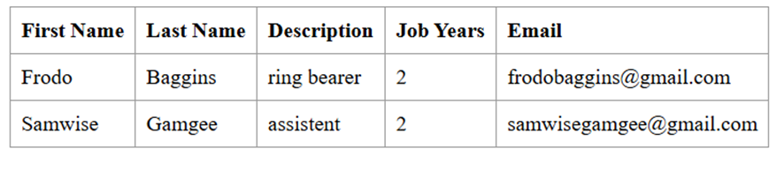
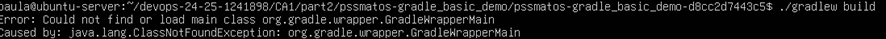
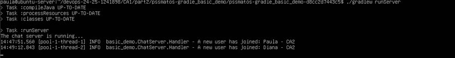
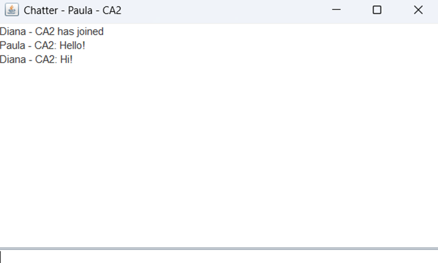
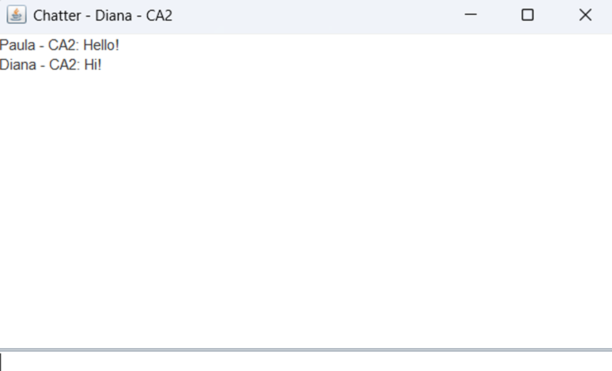
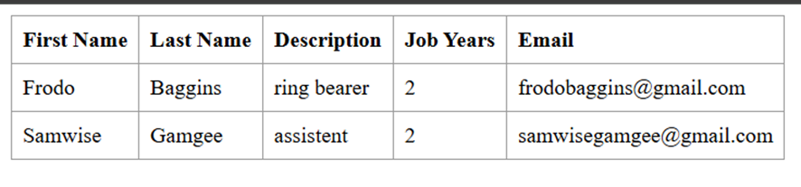
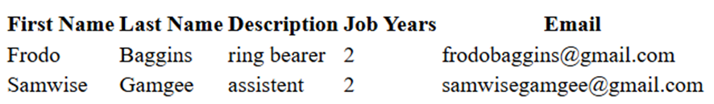
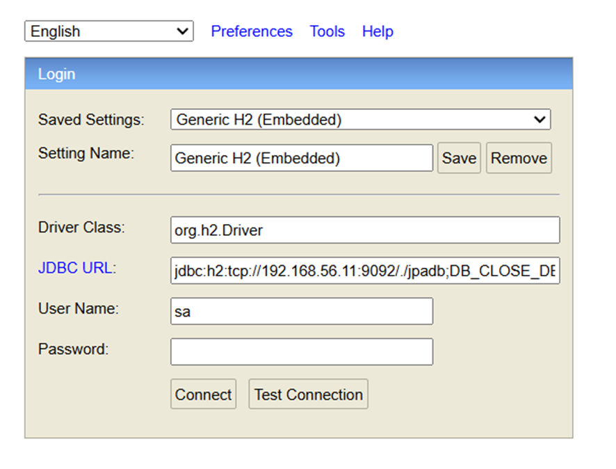
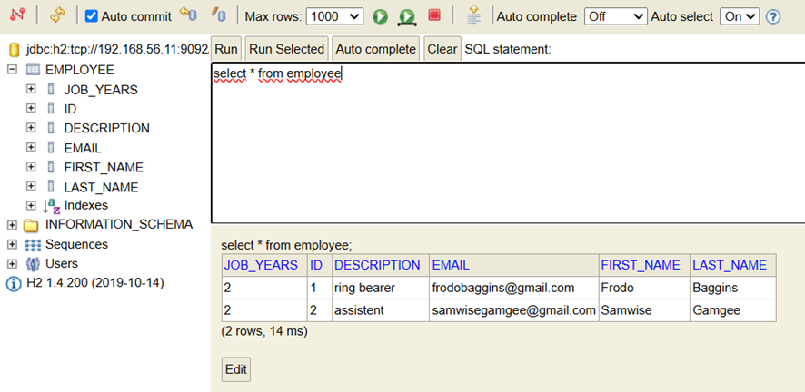

# CA2 - Technical Report  

## Table Of Contents  

- [CA2 - Part1: Virtualization with Vagrant - Technical Report](#ca2---part1-virtualization-with-vagrant---technical-report)
- [Part 1 - Introduction](#part-1---introduction)
- [Part 1 - Setup and configuration](#part-1---setup-and-configuration)
- [Part 1 - Install project dependencies](#part-1---install-project-dependencies)
- [Part 1 - Clone the individual repository inside the VM](#part-1---clone-the-individual-repository-inside-the-vm)
- [Part 1  - Possible issues running the projects in the VM](#part-1---possible-issues-running-the-projects-in-the-vm)
- [Part 1 - Maven-based Spring Boot Tutorial Basic Project](#part-1---maven-based-spring-boot-tutorial-basic-project)
- [Part 1 - Gradle-based Spring Boot Tutorial Basic Project](#part-1---gradle-based-spring-boot-tutorial-basic-project)
- [Part 1 - Conclusion](#conclusion)
- [CA2 - Part2: Virtualization with Vagrant - Technical Report](#ca2---part2-virtualization-with-vagrant---technical-report)
- [Part 2 - Introduction](#part-2---introduction)
- [Part 2 - Setup and configuration](#part-2---setup-and-configuration)
- [Part 2 - Vagrantfile](#part-2---vagrantfile)
- [Part 2 - Connecting Spring Boot to H2 Database](#part-2---connecting-spring-boot-to-h2-database)
- [Part 2 - Running the Application](#part-2---running-the-application)
- [Part 2 - Alternative Solution](#part-2---alternative-solution)
- [Part 2 - Conclusion](#part-2---conclusion)

# CA2 - Part1: Virtualization with Vagrant - Technical Report

Author: Ana Paula Lopes Nestor

Programme: SWitCH DEV


Course: DevOps

## Part 1 - Introduction

This part of the report covers the work done for **CA2 - Part1**, which involved using **VirtualBox** to explore virtualization in a DevOps context. The objective was to recreate a development environment inside a virtual machine and use it to run projects built earlier in the course.
Instead of using a local IDE as in previous assignments, this time all development and execution were done inside a VM. This shift allowed for a closer simulation of real-world DevOps environments, where code often runs in isolated, reproducible systems.  

## Part 1 - Setup and configuration

Since I had previously installed and configured a VirtualBox Virtual Machine (VM) in the last semester for the SCOMRED course, I reused that setup for this assignment. As a result, the base VM installation and initial configuration steps were already completed.

However, the process to set up the VM from scratch, would involve the following steps:

1. **Download and install VirtualBox** from [virtualbox.org](https://www.virtualbox.org/wiki/Downloads).
2. **Create a new VM**, selecting Linux (Ubuntu 64-bit) as the OS and allocating 2048 MB of RAM.
3. **Mount the Ubuntu 18.04 Minimal ISO** in the VM's storage settings to begin the OS installation.
4. **Start the VM** and follow the installation steps to complete the Ubuntu setup.
5. **Install VirtualBox Guest Additions** for better integration with the host.
6. **Configure network settings**:
    - Adapter 1: set to **NAT** for internet access.
    - Adapter 2: set to **Host-only Adapter** (vboxnet0) for communication with the host machine.

To configure the Host-only Adapter the following steps should be taken:

1. Go to **File > Host Network Manager** in VirtualBox.
2. Click **Create** to add a new Host-only network (e.g., `vboxnet0`).
3. Check the IP range of the created network — in this case, it was `192.168.56.1/24`.
4. Assign a static IP within that range to the second adapter of the VM, in this case `192.168.56.5`.  

After starting the virtual machine, I only needed to run step 1 to ensure the package repositories were up to date, and step 6, as the rest of the configuration had already been completed for the SCOMRED course. However, the following steps are essential for setting up network access and remote connectivity in a new environment.

1. **Update package repositories**  
   Run the following command to ensure all package lists are up to date:
   ```
   sudo apt update
   ```
2. **Install network tools**  
   To facilitate network configuration, install the necessary tools:
    ```
    sudo apt install net-tools
    ```  
3. **Edit the Netplan configuration to assign a static IP**  
   Open the network configuration file with the following command:
    ```
    sudo nano /etc/netplan/50-cloud-init.yaml
    ```  
   And ensure the file contains the following configuration:
    ```
    network:
        ethernets:
          enp0s3:
            dhcp4: yes
          enp0s8:
            addresses:
              - 192.168.56.5/24
        version: 2
    ```  
4. **Install OpenSSH server**  
   To enable remote access via SSH, the OpenSSH server needs to be installed:
    ```
    sudo apt install openssh-server
    ```  
5. **Enable password authentication for SSH**  
   Edit the SSH configuration file:
    ```
    sudo nano /etc/ssh/sshd_config
    ```  
   By locating and uncommenting the following line:
    ```
    PasswordAuthentication yes
    ```  
   Then, the SSH service should be restarted to apply the changes:
    ```
    sudo service ssh restart
    ``` 
6. **Install an FTP server**  
    To enable the FTP protocol for file transfers to and from the VM, the next step is to install the FTP server. In this case, I installed `vsftpd` by running the following command:
    ```
    sudo apt install vsftpd
    ```
    In order to enable write access for `vsftpd`, I edited the configuration file:
    ```
    sudo nano /etc/vsftpd.conf
    ```  
   And uncommented the following line to allow write access:
    ```
    write_enable=YES
    ```  
   Afterward, I restarted the FTP service to apply the changes:
    ```
    sudo service vsftpd restart
    ```  

## Part 1 - Install project dependencies

Before building and running the Java-based projects I worked on in CA1 (`springboot_basic_tutorial` and `gradle_basic_demo`), it was necessary to install several dependencies in the virtual machine.  
1. **Install Git**: The first dependency I installed was Git, required to **clone repositories** and manage version control:
```
sudo apt install git
 ``` 
2. **Install Java**: Then, I installed Java. Java is necessary to **compile and run** the Spring Boot and Gradle-based projects. I installed OpenJDK 17 using the headless version (the headless version of the JDK does not include graphical user interface (GUI) components. This makes it lighter and more suitable for environments like servers or virtual machines where no graphical interface is needed):
```
sudo apt install openjdk-17-jdk-headless
 ``` 
3. **Install Maven**: Maven is used to manage dependencies and build Java projects, and was the next dependency I installed:
```
sudo apt install maven
 ``` 
4. **Install Gradle**: Gradle is used to build the gradle_basic_demo project. Although Gradle was already installed in my VM from a previous tutorial here are the steps to install gradle manually:
```
wget https://services.gradle.org/distributions/gradle-8.12-bin.zip
sudo mkdir /opt/gradle
sudo unzip -d /opt/gradle gradle-8.12-bin.zip
 ``` 
Finally, I checked that all tools were correctly installed by verifying their versions:
```
git --version
java --version
mvn --version
gradle --version
 ``` 
At this point, the virtual machine was ready to build and execute the projects developed in previous assignments.

## Part 1 - Clone the individual repository inside the VM

To clone my individual repository inside the virtual machine, I first needed to set up secure SSH access between the VM and my GitHub repository.
The first step was to generate a new SSH key pair. I created a new SSH key pair in the VM to ensure secure communication with GitHub. I ran the following command to generate the key:
```
ssh-keygen -t ed25519 -C "1241898@isep.ipp.pt"
```  
After generating the key, I verified that it was created by listing the contents of the .ssh directory:
```
ls ~/.ssh/
```  
To add the newly created SSH key to my GitHub account, I accessed the key content by displaying it in the terminal:
```
cat ~/.ssh/id_ed25519.pub
```  
Next, I logged into my GitHub account, navigated to **Settings -> SSH and GPG keys**, and clicked on **New SSH key**. I pasted the key into the field provided and saved it, allowing my **VM to authenticate securely with GitHub**.  
Finally, with SSH configured, I **cloned my repository** into the desired directory within the VM using the following command:
```
git clone git@github.com:PaulaNestor/devops-24-25-1241898.git
```  

## Part 1  - Possible issues running the projects in the VM

Since the virtual machine is based on **Ubuntu Server**, it does **not include a graphical user interface (GUI)**. This means that any project or task that requires launching windows or interacting with a desktop environment **will not work directly within the VM**.
In this assignment, some of the projects developed previously require GUI interaction:

- The **Spring Boot project, Maven-based,** and the **Gradle version of the same project** provide a web interface that needs to be accessed via a web browser. Since the VM does not have a browser, these projects must be accessed through a browser running on the **host machine**. For that to work, proper networking (e.g., host-only adapter) must be set up and the correct IP address of the VM used.
- The **server-side of the chat project** can run fully within the VM. However, the **client-side interface**, which launches windows for the user to interact with, **requires a desktop environment**. Therefore, the server can be started inside the VM, but the clients must be run from the **host machine**, or another machine with GUI capabilities.

These restrictions are normal when using minimal server environments, and understanding how to split responsibilities between VM and host is an important part of DevOps and system administration practices.  

## Part 1 - Maven-based Spring Boot Tutorial Basic Project

In this section, I executed the **Spring Boot tutorial basic project**, which is **Maven-based** and was part of the prerequisites from CA1. The goal was to **build and run** the project within the virtual machine environment set up previously.
First, I navigated to the directory where the project files are located. This directory contains the setup for the Spring Boot application.

When attempting to run the application, I encountered an **error** indicating that I did not have permission to execute the **mvnw** script. To resolve this, I executed the following command to grant **execute permissions** to the script:
```
chmod +x ./mvnw
```  
After this, I was **able to run** the application using the following command within the project directory:
```
./mvnw spring-boot:run
```  
As explained previously, the **Ubuntu Server VM** does not have a **graphical user interface (GUI)**, and the Spring Boot application provides a web interface that can only be accessed through a browser. Therefore, **the browser must be opened on the host machine, not on the VM**.
To ensure the application was accessible from the host machine or other devices on the same network, I used the **IP address of the VM**. Here’s the URL I used to access the application:  
```
http://192.168.56.5:8080/
```  
The application loaded successfully, displaying the expected content. This confirms that the backend was functioning correctly and the Spring Boot framework was properly serving the content. The image bellows shows the result:  
  

## Part 1 - Gradle_basic_demo Project - Chat Server and Client

In this section, I describe the process of building and running the **gradle_basic_demo project**, which involved executing the **server** inside the **VM** and the **client** on the **host machine**. This setup was necessary due to the nature of the virtual machine and its **lack of a graphical user interface (GUI)**, as discussed previously.
I first navigated to the **CA1 part2** directory within the virtual machine and encountered a permission issue when attempting to execute the **gradlew** script. To resolve this, I executed the following command to grant execute permissions:
```
chmod +x ./gradlew
```  
After ensuring the script had the correct permissions, I attempted to run the build command:
```
./gradlew build
```  
However, I encountered an error related to the **Gradle Wrapper**, which prevented the build from running. The error message was the following:


To resolve this, I ran the following command to regenerate the gradle wrapper:  
```
./gradle wrapper
```  
This command allowed me to run the build successfully. After that, I was able to execute the **./gradlew build** command. This command **successfully** compiled the project and generated the necessary files.  

Once the project was built, I proceeded to **run the chat server inside the VM**. I executed the following command:  
```
./gradlew runServer
```  
This started the server, and it began listening for connections on port 59001:  
  

Since the **Ubuntu Server VM does not have a GUI**, running the client application (which requires a window interface for user interaction) directly inside the VM was not feasible. Therefore, I **ran the client on the host machine**. This separation of responsibilities (server inside the VM, client on the host) is crucial for projects that involve GUI-based interactions but are running in a headless environment.
To connect the client to the server running inside the VM, I executed the following command on the host machine, ensuring it was able to **connect to the VM’s IP address** (in this case, 192.168.56.5) and port 59001:
```
gradlew runClient --args="192.168.56.5 59001"
```  
This allowed the client on the host machine to communicate with the server running in the VM, facilitating the two-way chat functionality, as seen in the images bellow:
  
  

## Part 1 - Gradle-based Spring Boot Tutorial Basic Project

The next part of the assignment focused on running the **Gradle-based version** of the Spring Boot application that had been executed previously using **Maven**.
The steps were quite similar, with the key difference being the use of **Gradle** as the build and execution tool.

After navigating to the appropriate directory, I built the project by executing the following command:
```
./gradlew build
```  
With the build successful, I launched the Spring Boot server using the following command:  
```
./gradlew bootRun
```  
This started the web application, making it accessible on port 8080. To verify that the server was up and running, I opened a browser on the host machine and entered the following URL:  
```
http://192.168.56.5:8080/
```  
This loaded the application’s landing page successfully, confirming that the server was running inside the VM, and that it was reachable from the host machine, as seen in the image bellow:  
  

## Conclusion

This report describes the process of preparing and working within a **virtualized development environment** for **CA2 Part 1**. The tasks involved included **setting up a virtual machine** using VirtualBox, **installing** essential development tools (such as Git, Java, Maven, and Gradle), and successfully **building and running** Java-based projects.
By executing both Maven and Gradle versions of the Spring Boot tutorial project, as well as the chat server application, it was possible to gain hands-on experience in **managing and testing software within a headless Linux environment**. This also required solving practical challenges, such as **executing GUI-dependent components from the host machine**, and **ensuring communication between the VM and host**. This part of the assignment emphasized the importance of configuring reliable and functional development environments — a critical step in any DevOps workflow. Understanding how to replicate real-world conditions within a controlled setup helps build the skills needed for system setup, testing, and maintenance.
Throughout the process, I faced and resolved practical issues such as setting execution permissions, configuring Gradle properly, and ensuring that the VM and host machine could communicate effectively. These challenges reinforced the importance of understanding the environment in which applications are executed and prepared me for managing similar setups in future development tasks.  
This part of the assignment contributed to building a stronger foundation for working in real-world DevOps contexts.  

# CA2 - Part2: Virtualization with Vagrant - Technical Report

## Part 2 - Introduction

This report documents the work done for **CA2 - Part 2**, which focused on **virtualization using Vagrant**.
The base for this assignment was a provided **Vagrantfile**, which I customized to better suit the requirements. The key modifications included updating the Vagrantfile to clone a specific part of my own repository (`CA1-part3`) that contains a Gradle-based Spring Boot application. Additionally, I made the necessary changes so that the Spring application connects to an external H2 database.
This last part of the report also includes an alternative solution. In this case, a hypervisor alternative to VirtualBox.  

## Part 2 - Setup and configuration

To prepare the virtualized environment using **Vagrant**, I followed the next steps:

1. **Download and Install Vagrant**: I downloaded the appropriate version of Vagrant for my operating system from the [Vagrant website](https://developer.hashicorp.com/vagrant/install), and completed the installation by following the default setup instructions.

2. **Verify Installation**: After installation, I opened a terminal and ran the following command to confirm that Vagrant was correctly installed:  
```
vagrant --version
```  
The execution of the command returned the installed version number, indicating that the setup was successful.  
To avoid committing unnecessary files to the repository, I updated the **.gitignore** file with the following entry: **.vagrant/**.  

The next steps involved:  

1. **Download the Base Project**: I downloaded the base project manually, to a folder in my computer, from the example repository, which includes the **Vagrantfile** and all the necessary initial configurations to set up the VMs.

2. **Copy the Vagrantfile to My Project**: After downloading, I copied the Vagrantfile to the appropriate folder in my own repository using the following command:  
```
cp Vagrantfile "C:\Users\paula\ProjetoDevOps\devops-24-25-1241898\CA2\part2"
```  
3. **Start the Virtualized Environment**: In the same directory as the Vagrantfile, I ran the following command:
```
vagrant up
```
This created two Vagrant-managed virtual machines: one for the database (db) and another for the Spring Boot application (web).  

4. **Access the Application**: Once the environment was up and running, I was able to access the Spring Boot application using the following URLs:  
```
http://localhost:8080/basic-0.0.1-SNAPSHOT/
http://localhost:8080/basic-0.0.1-SNAPSHOT/h2-console
```  

## Part 2 - Vagrantfile

The Vagrantfile defines the configuration and provisioning of the virtual machines. After copying the base version, I made several key changes to customize it for this project:

- **Updated the Repository URL**: First, I changed the Git repository URL to point to **my own project**, which includes a **Gradle-based Spring Boot application**.  
```
git clone git@github.com:PaulaNestor/devops-24-25-1241898.git
```  
- **Modified the Path**: After that, I modified the path in the Vagrantfile to point to the correct directory.  
```
cd devops-24-25-1241898/CA1/part3/react-and-spring-data-rest-basic
```  
- **Added the bootRun Command**: Next, I included the `./gradlew bootRun` command in the provisioning script so the Spring Boot application starts automatically when the VM is provisioned.

- **Updated Java Version**: I also **switched the Java version to OpenJDK 17**, in line with the application's requirements.
```
openjdk-17-jdk-headless
```  
- **Enabled SSH Agent Forwarding**: To allow the VM to use the SSH credentials from the host machine I added:
```
config.ssh.forward_agent = true
```  
- **Automatically Trust GitHub SSH Host Key**: Finally, I added a command to the provisioning script that ensures github.com is added to the VM's list of known SSH hosts, to avoid manual confirmation during the first SSH connection:  
```
if [ ! -n "$(grep "^github.com " ~/.ssh/known_hosts)" ]; then
   ssh-keyscan github.com >> ~/.ssh/known_hosts 2>/dev/null
fi
```  
Since my project is stored in a **private Git repository**, cloning it during VM provisioning requires authentication. However, the provisioning process must run **without user interaction**, and Git's password prompt interrupts this flow. To solve this, I used **SSH agent forwarding**, which lets the VM access my SSH credentials securely from the host machine. This avoids the need to manually enter a password or set up additional credentials inside the VM.

To make this work I created an **SSH key**, following the steps already described in **CA2 - Part 1**, to set up SSH on my host machine, and added it to GitHub. 
After that, I started the SSH agent:
```
eval "$(ssh-agent -s)"
```
Added my SSH key:
```
ssh-add ~/.ssh/id_ed25519
```
And made the changes on the vagrantfile described earlier.  
Here's the updated Vagrantfile:
```
# See: https://manski.net/2016/09/vagrant-multi-machine-tutorial/
# for information about machine names on private network
Vagrant.configure("2") do |config|
  config.ssh.forward_agent = true
  config.vm.box = "ubuntu/bionic64"

  # This provision is common for both VMs
  config.vm.provision "shell", inline: <<-SHELL
    sudo apt-get update -y
    sudo apt-get install -y iputils-ping avahi-daemon libnss-mdns unzip \
        openjdk-17-jdk-headless
    # ifconfig
  SHELL

  #============
  # Configurations specific to the database VM
  config.vm.define "db" do |db|
    db.vm.box = "ubuntu/bionic64"
    db.vm.hostname = "db"
    db.vm.network "private_network", ip: "192.168.56.11"

    # We want to access H2 console from the host using port 8082
    # We want to connet to the H2 server using port 9092
    db.vm.network "forwarded_port", guest: 8082, host: 8082
    db.vm.network "forwarded_port", guest: 9092, host: 9092

    # We need to download H2
    db.vm.provision "shell", inline: <<-SHELL
      wget https://repo1.maven.org/maven2/com/h2database/h2/1.4.200/h2-1.4.200.jar
    SHELL

    # The following provision shell will run ALWAYS so that we can execute the H2 server process
    # This could be done in a different way, for instance, setting H2 as as service, like in the following link:
    # How to setup java as a service in ubuntu: http://www.jcgonzalez.com/ubuntu-16-java-service-wrapper-example
    #
    # To connect to H2 use: jdbc:h2:tcp://192.168.33.11:9092/./jpadb
    db.vm.provision "shell", :run => 'always', inline: <<-SHELL
      java -cp ./h2*.jar org.h2.tools.Server -web -webAllowOthers -tcp -tcpAllowOthers -ifNotExists > ~/out.txt &
    SHELL
  end

  #============
  # Configurations specific to the webserver VM
  config.vm.define "web" do |web|
    web.vm.box = "ubuntu/bionic64"
    web.vm.hostname = "web"
    web.vm.network "private_network", ip: "192.168.56.10"

    # We set more ram memory for this VM
    web.vm.provider "virtualbox" do |v|
      v.memory = 1024
    end

    # We want to access tomcat from the host using port 8080
    web.vm.network "forwarded_port", guest: 8080, host: 8080

    web.vm.provision "shell", inline: <<-SHELL, privileged: false
      # sudo apt-get install git -y
      # sudo apt-get install nodejs -y
      # sudo apt-get install npm -y
      # sudo ln -s /usr/bin/nodejs /usr/bin/node
      sudo apt install -y tomcat9 tomcat9-admin
      # If you want to access Tomcat admin web page do the following:
      # Edit /etc/tomcat9/tomcat-users.xml
      # uncomment tomcat-users and add manager-gui to tomcat user

      # Change the following command to clone your own repository!
      if [ ! -n "$(grep "^github.com " ~/.ssh/known_hosts)" ]; then
          ssh-keyscan github.com >> ~/.ssh/known_hosts 2>/dev/null
      fi
      git clone git@github.com:PaulaNestor/devops-24-25-1241898.git
      cd devops-24-25-1241898/CA1/part3/react-and-spring-data-rest-basic
      chmod u+x gradlew
      ./gradlew clean build
      ./gradlew bootRun
      # To deploy the war file to tomcat9 do the following command:
      sudo cp ./build/libs/react-and-spring-data-rest-basic-0.0.1-SNAPSHOT.jar /var/lib/tomcat9/webapps
    SHELL
  end
end
```  

## Part 2 - Connecting Spring Boot to H2 Database

To connect the Spring Boot application to the H2 database running in the virtual machine (VM), I made the following changes to the application configuration files:    

1. In the Spring Boot project, I modified the `application.properties` file located at `src/main/resources/application.properties`. The changes are as follows:  
```
server.servlet.context-path=/basic-0.0.1-SNAPSHOT
spring.data.rest.base-path=/api
spring.datasource.url=jdbc:h2:tcp://192.168.56.11:9092/./jpadb;DB_CLOSE_DELAY=-1;DB_CLOSE_ON_EXIT=FALSE
spring.datasource.driverClassName=org.h2.Driver
spring.datasource.username=sa
spring.datasource.password=
spring.jpa.hibernate.ddl-auto=create-drop
spring.sql.init.mode=never
spring.h2.console.enabled=true
spring.h2.console.path=/h2-console
spring.h2.console.settings.web-allow-others=true
```  
2. Also, the `src/App.js` needed adjustments to match the new backend path:
```
client({method: 'GET', path: '/basic-0.0.1-SNAPSHOT/api/employees'}).done(response => {
```  
Since this project makes use of the setup from **CA1 - Part 3**, the changes in the application.properties and App.js files were made inside the CA1 - Part 3.  

## Part 2 - Running the Application

To start the virtual machines (VMs) and run the Spring Boot application, I navigated to the project directory and executed the following command:
```
vagrant up
```  
This command **starts the two VMs (web and db)** and **provisioned** them according to the settings defined in the **Vagrantfile**. It takes a while for the VMs to start the first time, as they are set up with the necessary software and configurations.  
After the **VMs were up and running**, I opened my web browser and visited the following URL to check if the Spring Boot application was running:
```
http://localhost:8080/basic-0.0.1-SNAPSHOT/
```  
The application loaded successfully, confirming that the Spring Boot app was running properly. Below is a screenshot of the result:  
  

I also needed to verify the H2 database connection. To do so, I opened the **H2 console** by visiting:  
```
http://localhost:8082/
```  
Here is a screenshot of the H2 Login page where I entered the connection information:
  

Once connected to the H2 database, I was able to view the tables and data stored in the database. I checked the EMPLOYEE table to ensure that the Spring Boot application was correctly interacting with the database. Below is a screenshot of the H2 console showing the database table EMPLOYEE:  
  
These steps confirmed that the Spring Boot application was functioning as expected and could successfully communicate with the H2 database. The application was able to retrieve and store data from the database, and the H2 console allowed me to verify the data stored in the backend.  

## Part 2 - Alternative Solution

As an **alternative to VirtualBox**, I explored **VMware** as a virtualization solution. VMware offers a powerful set of features and can be used together with Vagrant to replicate the environment setup required for this project.

| Feature            | VirtualBox                                  | VMware (Workstation / Fusion)                        |
|--------------------|----------------------------------------------|------------------------------------------------------|
| **Type**           | Free and open-source hypervisor              | Commercial-grade virtualization platform             |
| **Performance**    | Adequate for small/medium use cases          | High performance, suitable for complex workloads     |
| **Ease of Use**    | User-friendly GUI                            | Slightly steeper learning curve                      |
| **Advanced Features** | Limited (e.g., basic snapshots)           | Rich feature set: advanced snapshots, cloning, etc.  |
| **Cost**           | Free                                         | Requires license after trial period                  |
| **Integration**    | Basic integration with Vagrant               | Requires additional setup but offers deeper control  |


VMware is often chosen in professional and enterprise environments for its speed, stability, and additional tooling. When **performance** and **advanced VM management** features are a priority, VMware becomes a compelling alternative, especially for more demanding applications or development stacks.

To use **VMware instead of VirtualBox with Vagrant**, the workflow is similar but requires a couple of additional tools and some configuration changes.
First, you need to install the **Vagrant VMware Utility**, which acts as a bridge between Vagrant and the VMware hypervisor. Without this utility, Vagrant cannot communicate with VMware to create or manage VMs. Next, the **Vagrant VMware plugin** must be installed. This plugin extends Vagrant to understand how to handle VMware-based machines, similarly to how Vagrant natively supports VirtualBox. Unlike VirtualBox, VMware support requires this extra step because it's a commercial product maintained separately. Finally, the `Vagrantfile` needs to be updated to explicitly set VMware as the provider. This means replacing any reference to VirtualBox with `vmware_desktop` and defining specific VM settings such as allocated memory or number of CPUs using VMware's syntax.  
Here’s an example configuration using VMware:
```
Vagrant.configure("2") do |config|
  config.vm.box = "hashicorp/bionic64"
  config.vm.provider "vmware_desktop" do |v|
    v.vmx["memsize"] = "1024"
    v.vmx["numvcpus"] = "2"
  end
end
```  
Alternatively, it is possible to run the VMs using the following command, explicitly selecting the provider:
```
vagrant up --provider=vmware_desktop
```  
These steps allow to provision and run the same project setup (like the one in this assignment) using VMware instead of VirtualBox. Just like with VirtualBox, running **vagrant up** will create and configure the VMs.  

No changes to the application code or provisioning logic are needed to support VMware. As long as the **correct Vagrant box and provider** are configured, the same setup used with VirtualBox applies to VMware. This ensures that all provisioning scripts, port mappings, and application behavior remain consistent, regardless of the virtualization platform used.  

## Part 2 - Conclusion

This report documented the process of **setting up and running a virtualized development environment** using Vagrant for CA2 - Part 2. The main goal was to **deploy a Spring Boot application connected to an H2 database**, and this was successfully achieved by modifying a base Vagrantfile, configuring SSH access, and adapting the Spring project to work within a multi-VM setup.
Throughout the assignment, I applied key DevOps practices such as environment automation, service provisioning, and system orchestration. I validated the application by interacting both with the frontend and the H2 database console, ensuring everything was running as expected in the virtual environment. Additionally, I explored **VMware as an alternative to VirtualBox**. Despite requiring additional setup and licensing, VMware offers stronger performance and a richer feature set, especially for larger or more complex systems. One of the main takeaways was understanding how to switch providers without needing to rewrite the core application or provisioning scripts — something that highlights the flexibility of infrastructure-as-code tools like Vagrant.
This assignment gave me the opportunity to really understand how backend services and virtual environments can work together in practice. It pushed me to troubleshoot real-world issues, like dealing with private repository authentication and managing SSH keys. These small challenges helped me feel more confident in working with DevOps tools and gave me a clearer picture of how applications are deployed and run outside the IDE, in environments that simulate real production setups.


